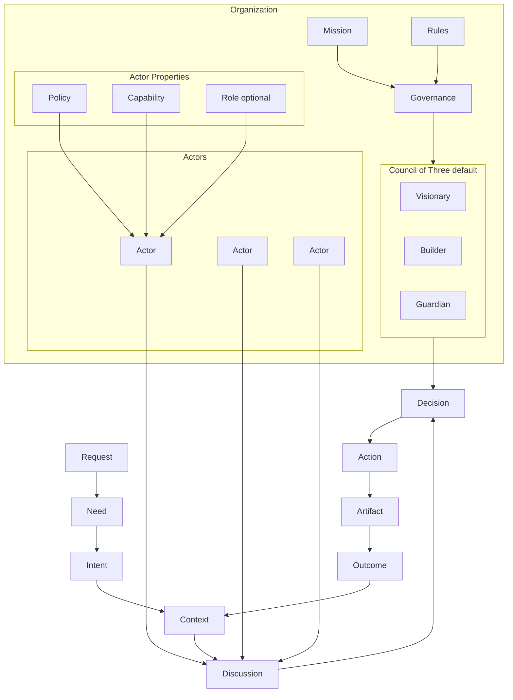
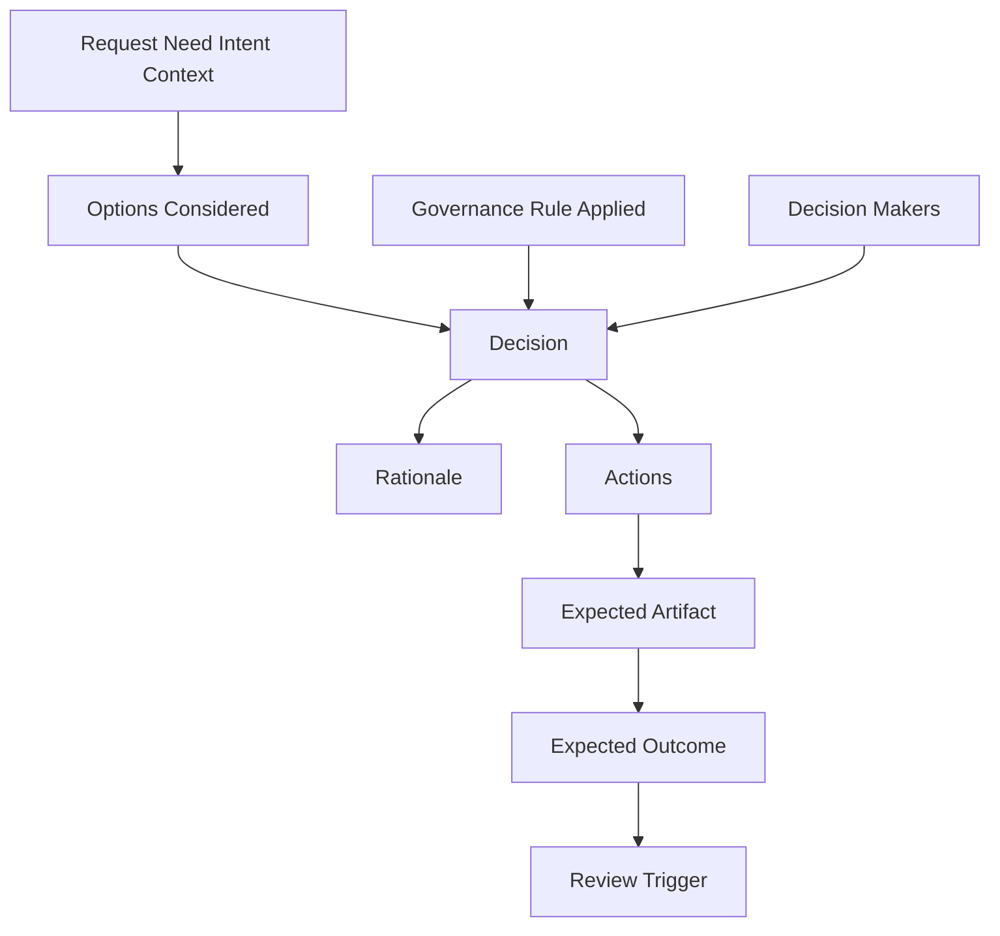
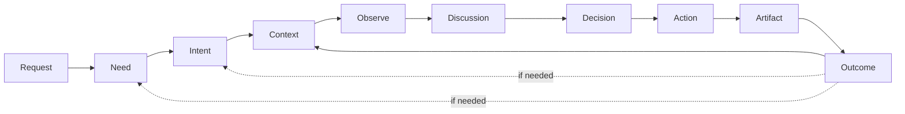

# AI Organization Framework

AI Organization Framework は、人間と AI の混成組織が、曖昧な要求から高品質な成果物と実際の成果を再現可能に生み出すための組織規格である。

これは AI エージェント規格ではない。  
解釈、議論、意思決定、実行、検証を含む、意思決定組織の規格である。

## 目的

人の曖昧な要求から

- 意図を汲み取り
- 制約を明確化し
- 適切な意思決定を行い
- 高品質な成果物を出し
- 結果を次の判断に還流させる

この流れを、AI と人間の組織として再現可能にする。

## 前提

現実の仕事は、単純な `Planner -> Executor -> Reviewer` では閉じない。  
実際には次の構造を持つ。

`要求 -> 解釈 -> 議論 -> 意思決定 -> 実行 -> 成果物 -> 結果`

この構造は、ソフト開発、建築、教育、ゲーム、経営などで共通している。

## コアモデル

フレームワークの最小ループは次の通り。

`Need -> Intent -> Context -> Discussion -> Decision -> Action -> Artifact -> Outcome`

`Outcome` は再び `Context` を更新し、必要なら `Need` や `Intent` の再解釈を引き起こす。

## 構成図

## 基本要素

### Request

利用者や顧客から与えられる表層的な要求。  
曖昧でもよい。`Request` は入力であり、解釈対象である。

例:

- 売上を伸ばしたい
- 3 分で楽しいゲームイベントを作りたい
- チームの開発速度を上げたい

### Need

本当に解決したいこと。  
`Request` の背後にある本質的な課題。

例:

- 利益を増やしたい
- 学習定着率を上げたい
- 家族が自然に集まる場を作りたい

### Intent

Need をどういう方向で実現するかという方針。
ドメインによっては `Vision` と呼んでもよいが、コア概念としては `Intent` に統一する。

例:

- 業務効率化したい
- 初回体験の面白さを高めたい
- 安全性を最優先で改善したい

### Context

意思決定時点の状況と制約。

例:

- 予算 500 万円
- 納期 3 ヶ月
- 法規制あり
- 既存システムと互換必須

### Actor

観察、提案、判断、実行を行う実体。  
人間でも AI でもよい。

例:

- Storyteller
- Facilitator
- Wizard
- Architect
- Builder
- Reviewer

### Role

Actor に付与される責務ラベル。  
Role は抽象概念であり、Actor そのものではない。

原則:

- Actor は実体
- Role は責務
- 1 つの Actor が複数 Role を持ってよい
- 1 つの Role を複数 Actor が担ってよい

このため、Role は必須のコア要素ではなく、組織設計上の補助概念とする。

### Policy

Actor または Organization が何を優先するかを示す判断基準。

例:

- 品質優先
- 安全性優先
- 面白さ優先
- 完走優先
- 学習効果優先

推奨する標準軸:

- Value
- Quality
- Safety
- Cost
- Speed
- Learning
- Delight

Policy は自由文ではなく、これらの軸への優先順位として表現すると再現性が高い。

### Capability

Actor が実際にできること。

例:

- 設計
- 実装
- 文章生成
- 画像生成
- 分析
- テスト

### Organization

共通の目的のもとで協働する Actor の集合。

例:

- Product Team
- Architecture Team
- Game Team

Organization は少なくとも次を持つ。

- Mission
- Rules
- Governance

### Governance

誰が、何を、どの条件で決めるかを定義する仕組み。  
このフレームワークの最重要概念である。

Governance がない組織は、Actor の寄せ集めでしかない。
Governance は Organization 全体だけでなく、特定の工程、成果物、リリース判断などの意思決定スコープごとに設定できる。

### Decision

議論を踏まえて採択された判断。  
Decision は `Action` を正当化する。

### Action

Decision に基づく実行。

### Artifact

Action によって生成された成果物。
Artifact は直接作られたものを指す。利用者体験や事業上の変化は、原則として Outcome として扱う。

例:

- 要件定義書
- 設計書
- コード
- テスト結果
- 図面
- ゲームイベント
- 画像

### Outcome

Artifact が現実にもたらした結果。  
Artifact と Outcome は同一ではない。

例:

- 売上が上がった
- 障害率が下がった
- プレイ継続率が上がった
- 学習定着率が改善した

## 整合性ルール

このフレームワークを矛盾なく運用するため、以下を原則とする。

1. `Request` はそのまま実行しない。必ず `Need` `Intent` `Context` に分解して解釈する。
2. `Actor` は `Policy` と `Capability` を持つことで初めて意味を持つ。
3. `Decision` は `Governance` によって確定する。Artifact の存在だけでは正当化されない。
4. `Action` は Artifact を作る。Outcome は Artifact の外部効果である。
5. `Outcome` は次の `Context` を更新し、必要なら `Need` と `Intent` を見直す。
6. ドメイン固有の工程名はコア概念ではない。AIDLC や建築工程は、このモデル上の具体的な写像である。

## 標準ガバナンステンプレート

### Council of Three

`Council of Three` は、最高意思決定機関の標準テンプレートである。  
ただし、これは唯一の普遍形ではなく、再利用しやすい既定形と位置づける。
ここでいう最高意思決定機関とは、対象となる意思決定スコープ内での最終判断者を意味する。

3 つの判断観点は次の通り。

- Visionary: 価値、目的適合、意味を見る
- Builder: 実現可能性、資源、工程を見る
- Guardian: 品質、安全、破綻リスクを見る

### 決定ルール

既定値:

- 原則は多数決
- 必要に応じて Guardian に拒否権を設定できる
- 拒否権は感覚ではなく、明示された Rule または Policy 違反を根拠に行使する

この構造により、価値、実現性、リスクの 3 観点を最低限カバーできる。

## 最小通信規格

Actor 間の通信は、まず次の最小セットで定義できる。

- Observe
- Propose
- Review
- Approve
- Reject
- Request Rework
- Report Outcome

完全なプロトコル仕様は今後の課題だが、少なくとも「提案」「承認」「差し戻し」「結果報告」は必須である。

## Decision Record

`Decision` を再現可能にするため、最低限次の項目を記録する。

1. `Decision ID`
2. `Scope`
3. `Request`
4. `Need`
5. `Intent`
6. `Context`
7. `Options Considered`
8. `Decision`
9. `Decision Makers`
10. `Governance Rule Applied`
11. `Rationale`
12. `Actions`
13. `Expected Artifact`
14. `Expected Outcome`
15. `Review Trigger`

これにより、何が入力で、誰が、どのルールで、何を根拠に決め、何を作り、どの結果を期待したかを追跡できる。

テンプレートは [docs/decision-record-template.md](/Users/mn/Documents/Codex/2026-05-30/ai-ai-organization-framework-ai-ai/docs/decision-record-template.md:1) に置く。

## 意思決定ループ

1. `Request` を受け取る
2. `Need` `Intent` `Context` を明確化する
3. Actor がそれぞれの Policy と Capability に基づいて観察する
4. Proposal と Review を通じて議論する
5. Governance に従って `Decision` を確定する
6. `Action` を実行する
7. `Artifact` を生成する
8. `Outcome` を観測する
9. `Outcome` を `Context` に還流し、次の判断に使う

## ドメイン適用

### AIDLC

ソフト開発を最初の実証対象とする。

例:

`Need -> Intent/Vision -> Context -> Requirements -> Design -> Implementation -> Test -> Release -> Outcome`

ここでの重要点は、各工程名そのものではない。  
各工程において、

- 誰が解釈するか
- 誰が決めるか
- 何を Artifact とみなすか
- 何を Outcome とみなすか

を Governance と結びつけて定義できるかが本質である。

### 建築

`Need -> Intent -> Context -> Design -> Drawings -> Construction -> Building(Artifact) -> Outcome`

### ゲーム

`Need -> Intent -> Context -> Event Design -> Game Event(Artifact) -> Play Experience(Outcome)`

## 現時点の結論

このフレームワークは、AI エージェントの役割分担表ではない。  
人間と AI が混成した意思決定組織をどう設計し、どう再現可能に運用するかの規格である。

最初の実証対象はゲームではなく AIDLC が最適である。  
理由は、日常的に観測しやすく、Artifact と Outcome の対応を追跡しやすく、工程ごとの Governance を検証しやすいからである。

## 未解決課題

1. Role をどこまで正式概念として残すか
2. Policy をどの粒度で標準化するか
3. Council of Three をどこまで既定形として採用するか
4. Actor 間通信の正式なメッセージ仕様をどう定義するか
5. AIDLC 実証の成功条件が実案件で機能するか
