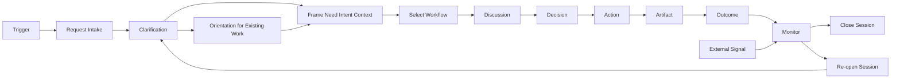
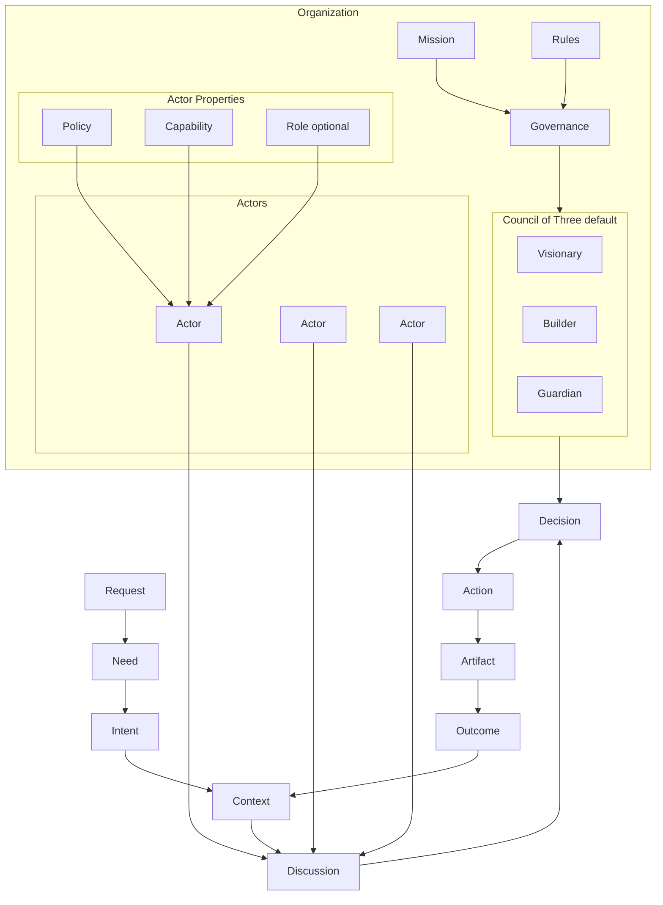
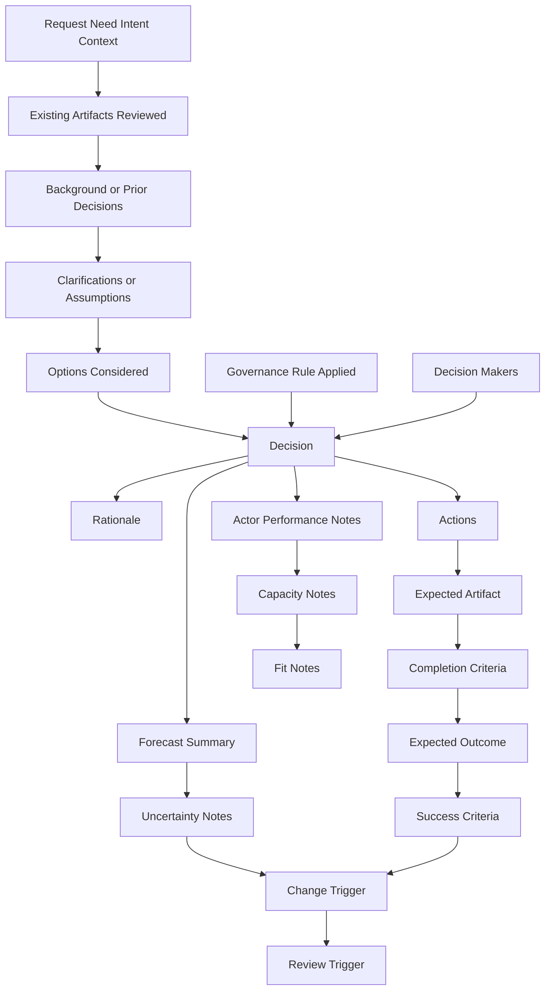
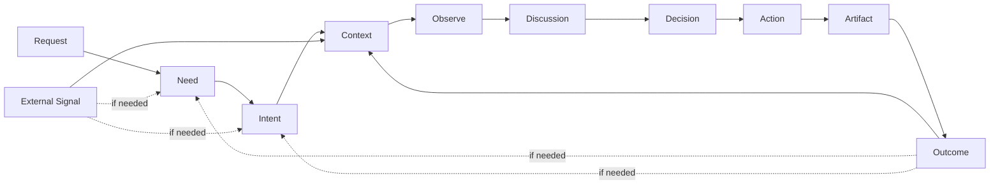

# AI Organization Framework

AI Organization Framework は、人間と AI の混成組織が、曖昧な要求から高品質な成果物と実際の成果を再現可能に生み出すための設計仕様である。

これは AI エージェント規格ではない。  
解釈、議論、意思決定、実行、検証を含む、意思決定組織の規格である。

## Elevator Pitch

このフレームワークで変えたいのは、AI 活用を「1 回の生成」ではなく「再現可能な意思決定組織」として扱うことである。  
入力された要求をそのまま処理するのではなく、`Need` `Intent` `Context` に分解し、governance を通じて判断し、Artifact と Outcome を分けて追跡する。

## Status

このリポジトリは、完成した標準そのものというより、将来の組織規格に向けた設計仕様書と初期 prototype の段階にある。  
現在は主要仕様を固め、最小の local runtime prototype まで進んでいる。

runtime の現在地と次の実装段階は [docs/runtime-prototype-plan.md](docs/runtime-prototype-plan.md) を参照する。  
最初の 10 分で local example を 1 回流すなら [docs/quickstart.md](docs/quickstart.md) を参照する。
live provider verification の実施手順は [docs/live-provider-verification.md](docs/live-provider-verification.md) を参照する。
CLI command の一覧と usage は [docs/cli-reference.md](docs/cli-reference.md) を参照する。
`v1` に何を含め、何を deferred とするかは [docs/v1-release-definition.md](docs/v1-release-definition.md) を参照する。
`v1.1` で何を進化対象とするかは [docs/v1.1-release-definition.md](docs/v1.1-release-definition.md) を参照する。
`v1` release candidate の gate と必要 evidence は [docs/v1-release-checklist.md](docs/v1-release-checklist.md) を参照する。
`v1` RC / release note を作るときの雛形は [docs/v1-release-candidate-template.md](docs/v1-release-candidate-template.md) を参照する。
現在の RC draft は [docs/v1.0.0-rc-draft.md](docs/v1.0.0-rc-draft.md) を参照する。

## 目的

人の曖昧な要求から

- 意図を汲み取り
- 制約を明確化し
- 適切な意思決定を行い
- 高品質な成果物を出し
- 結果を次の判断に還流させる

この流れを、AI と人間の組織として再現可能にする。

## 前提

現実の仕事は、単純な `Planner -> Executor -> Reviewer` では閉じない。  
実際には次の構造を持つ。

`要求 -> 解釈 -> 議論 -> 意思決定 -> 実行 -> 成果物 -> 結果`

この構造は、ソフト開発、建築、教育、ゲーム、経営などで共通している。

## Positioning

既存の AI エージェント協調フレームワークは、複数 agent や tool をどう編成して実行するかに強い。  
このフレームワークは、その一段上で「誰が何を根拠に決めるか」「Done と Success をどう分けるか」「Context をどう更新するか」を定義する。

言い換えると、AutoGen、CrewAI、LangGraph のような実行フレームワークと競合するというより、上位の組織設計モデルとして併用できる位置づけを狙っている。

## コアモデル

フレームワークの最小ループは次の通り。

`Need -> Intent -> Context -> Discussion -> Decision -> Action -> Artifact -> Outcome`

`Outcome` は再び `Context` を更新し、必要なら `Need` や `Intent` の再解釈を引き起こす。
`External Signal` は `Outcome` と別に `Context` を更新し、必要なら `Need` や `Intent` の再解釈を引き起こす。

## 運用ワークフロー

runtime として動かす場合、実際の開始点は `Request` より前の `Trigger` になる。  
また、曖昧な要求を扱うため、`Request` 受領後には `Clarification` を標準運用フェーズとして置く。

`Clarification` は新しいコア成果物ではない。  
`Need` `Intent` `Context` を十分に定義するための質問、追加調査、前提確認、仮説の明示を行うフェーズである。

`Clarification` の詳細仕様は [docs/clarification-phase.md](docs/clarification-phase.md) を正本とする。
運用上の safeguard は [docs/operational-safeguards.md](docs/operational-safeguards.md) を参照する。
質問選択ロジックは [docs/clarification-question-selection.md](docs/clarification-question-selection.md) を参照する。

入力が十分に明確な場合は `Clarification` を短縮または省略してよい。  
入力が曖昧な場合は、利用者への質問や既存資料の確認を経てから framing に進む。

既存案件に適用する場合は、`Clarification` の中で `Orientation` を行う。  
ここでは背景、経緯、既存 Artifact、過去の意思決定、現状の制約、未解決課題を把握してから framing に進む。

`Orientation` の詳細仕様は [docs/orientation-phase.md](docs/orientation-phase.md) を正本とする。

## 構成図

## 基本要素

### Request

利用者や顧客から与えられる表層的な要求。  
曖昧でもよい。`Request` は入力であり、解釈対象である。

例:

- 売上を伸ばしたい
- 3 分で楽しいゲームイベントを作りたい
- チームの開発速度を上げたい

### Need

本当に解決したいこと。  
`Request` の背後にある本質的な課題。

例:

- 利益を増やしたい
- 学習定着率を上げたい
- 家族が自然に集まる場を作りたい

### Intent

Need をどういう方向で実現するかという方針。
ドメインによっては `Vision` と呼んでもよいが、コア概念としては `Intent` に統一する。

例:

- 業務効率化したい
- 初回体験の面白さを高めたい
- 安全性を最優先で改善したい

### Context

意思決定時点の状況と制約。

例:

- 予算 500 万円
- 納期 3 ヶ月
- 法規制あり
- 既存システムと互換必須

### Actor

観察、提案、判断、実行を行う実体。  
人間でも AI でもよい。

例:

- Storyteller
- Facilitator
- Wizard
- Architect
- Builder
- Reviewer

人間は外部オブザーバーではなく、必要なら正式な `Actor` として Council、escalation、final approval に参加できる。

### Role

Actor に付与される責務ラベル。  
Role は抽象概念であり、Actor そのものではない。
正式な規範強度は [docs/role-model.md](docs/role-model.md) を正本とする。

原則:

- Actor は実体
- Role は責務
- 1 つの Actor が複数 Role を持ってよい
- 1 つの Role を複数 Actor が担ってよい

このため、Role は必須のコア要素ではなく、組織設計上の補助概念とする。  
ただし、使う場合は Actor identity を置き換えてはならず、責務ラベルとして扱う。

### Policy

Actor または Organization が何を優先するかを示す判断基準。

例:

- 品質優先
- 安全性優先
- 面白さ優先
- 完走優先
- 学習効果優先

推奨する標準軸:

- Value
- Quality
- Safety
- Cost
- Speed
- Learning
- Delight

Policy は自由文ではなく、これらの軸への優先順位として表現すると再現性が高い。  
標準軸と表現ルールの詳細は [docs/policy-model.md](docs/policy-model.md) を正本とする。

### Capability

Actor が実際にできること。

例:

- 設計
- 実装
- 文章生成
- 画像生成
- 分析
- テスト

### Performance Profile

Actor がどの程度の品質、速度、安定性、コストで仕事をするかを示す。  
`Capability` とは別概念である。

### Capacity

Actor がどの程度の並列実行、文脈保持、調整負荷に耐えられるかを示す。  
AI worker を扱うときに重要になる。

### Organization

共通の目的のもとで協働する Actor の集合。

例:

- Product Team
- Architecture Team
- Game Team

Organization は少なくとも次を持つ。

- Mission
- Rules
- Governance

### Governance

誰が、何を、どの条件で決めるかを定義する仕組み。  
このフレームワークの最重要概念である。

Governance がない組織は、Actor の寄せ集めでしかない。
Governance は Organization 全体だけでなく、特定の工程、成果物、リリース判断などの意思決定スコープごとに設定できる。
軽量 task 向けの `Fast Track` と、高リスク task 向けの `Deep Path` を分けてよい。

### Assignment Authority

誰が Actor を Role や governance seat に割り当てるかも Governance の一部として扱う。  
標準では、organization の governance owner が assignment rule を持ち、runtime は template default に従って割り当てる。必要なら human maintainer が override する。

例:

- template default で `Visionary / Builder / Guardian` を割り当てる
- release-critical scope だけ human maintainer が Guardian を指名する
- deadlock 時は escalation authority が seat 再割り当てを行う

### Decision

議論を踏まえて採択された判断。  
Decision は `Action` を正当化する。

### Action

Decision に基づく実行。

### Artifact

Action によって生成された成果物。
Artifact は直接作られたものを指す。利用者体験や事業上の変化は、原則として Outcome として扱う。

例:

- 要件定義書
- 設計書
- コード
- テスト結果
- 図面
- ゲームイベント
- 画像

### Outcome

Artifact が現実にもたらした結果。  
Artifact と Outcome は同一ではない。

例:

- 売上が上がった
- 障害率が下がった
- プレイ継続率が上がった
- 学習定着率が改善した

### External Signal

自分たちの `Action` と独立に外部から入る変化。  
`Outcome` とは別に扱う。

### Completion Criteria

Artifact が `done` とみなせる条件。  
工程内の完了条件であり、成功条件とは別である。

### Success Criteria

Outcome が `successful` とみなせる条件。  
外部結果の達成条件であり、完了条件とは別である。

### Forecast

意思決定に必要な予測情報。  
`Estimate` はその 1 形式にすぎず、コア必須概念ではない。

## 整合性ルール

このフレームワークを矛盾なく運用するため、以下を原則とする。

1. `Request` はそのまま実行しない。必ず `Need` `Intent` `Context` に分解して解釈する。
2. `Actor` は `Policy`、`Capability`、必要なら `Performance Profile` と `Capacity` を持つことで初めて意味を持つ。
3. `Decision` は `Governance` によって確定する。Artifact の存在だけでは正当化されない。
4. `Action` は Artifact を作る。Outcome は Artifact の外部効果である。
5. `External Signal` は `Outcome` と別に扱う。
6. `Completion Criteria` と `Success Criteria` は分けて定義する。
7. `Forecast` は任意であり、必要な判断だけに使う。
8. AI worker を比較するときは、`Capability` だけでなく `Performance Profile` と `Capacity` を使う。
9. `Outcome` と `External Signal` は次の `Context` を更新し、必要なら `Need` と `Intent` を見直す。
10. ドメイン固有の工程名はコア概念ではない。AIDLC や建築工程は、このモデル上の具体的な写像である。

## 標準ガバナンステンプレート

### Council of Three

`Council of Three` は、最高意思決定機関の標準テンプレートである。  
ただし、これは唯一の普遍形ではなく、再利用しやすい既定形と位置づける。
ここでいう最高意思決定機関とは、対象となる意思決定スコープ内での最終判断者を意味する。
より厳密な規範強度と代替条件は [docs/governance-template-model.md](docs/governance-template-model.md) を正本とする。

3 つの判断観点は次の通り。

- Visionary: 価値、目的適合、意味を見る
- Builder: 実現可能性、資源、工程を見る
- Guardian: 品質、安全、破綻リスクを見る

### 決定ルール

既定値:

- 原則は多数決
- 必要に応じて Guardian に拒否権を設定できる
- 拒否権は感覚ではなく、明示された Rule または Policy 違反を根拠に行使する

この構造により、価値、実現性、リスクの 3 観点を最低限カバーできる。

### 代替ガバナンスの許容条件

`Council of Three` を使わないこと自体は許容される。  
ただし、代替ガバナンスは少なくとも次を満たす必要がある。

1. decision scope ごとの最終判断者が明示されている
2. value / feasibility / risk の 3 観点が、席でも review gate でもよいので欠落なく扱われる
3. decision rule と veto rule が明示されている
4. deadlock 時の escalation path がある
5. decision record に表現できる

言い換えると、`Council of Three` は mandatory な形ではなく、minimum governance guarantees を満たしやすい default template である。

## 最小通信規格

Actor 間の通信は、まず次の最小セットで定義できる。

- Observe
- Propose
- Review
- Approve
- Reject
- Request Rework
- Report Outcome
- Escalate

正式なプロトコル仕様は [docs/actor-communication-protocol.md](docs/actor-communication-protocol.md) を正本とする。
少なくとも「提案」「承認」「差し戻し」「結果報告」は必須である。
実運用では `Max Retries`、`Timeout`、`Escalation Target` を持たせてデッドロックを避ける。

## Decision Record

`Decision` を再現可能にするため、最低限次の項目を記録する。

1. `Record Format Version`
2. `Decision ID`
3. `Created At`
4. `Canonical Markdown Path`
5. `Scope`
6. `Request`
7. `Need`
8. `Intent`
9. `Context`
10. `Existing Artifacts Reviewed`
11. `Background or Prior Decisions`
12. `Clarifications or Assumptions`
13. `Options Considered`
14. `Decision`
15. `Decision Makers`
16. `Governance Rule Applied`
17. `Rationale`
18. `Actions`
19. `Expected Artifact`
20. `Expected Outcome`
21. `Completion Criteria`
22. `Success Criteria`
23. `Completion Approval Scope`
24. `Success Evaluation Scope`
25. `Forecast Summary optional`
26. `Uncertainty Notes optional`
27. `Change Trigger optional`
28. `Actor Performance Notes optional`
29. `Capacity Notes optional`
30. `Fit Notes optional`
31. `Protocol Thread ID optional`
32. `Routing Mode optional`
33. `Escalation Target optional`
34. `Context Snapshot ID required, nullable before first snapshot`
35. `Review Trigger`

これにより、何が入力で、どの背景を引き継ぎ、どの曖昧さをどう解消し、誰が、どのルールで、何を根拠に決め、何を作り、どの結果を期待したかを追跡できる。

テンプレートは [docs/decision-record-template.md](docs/decision-record-template.md) に置く。
機械可読 companion の schema は [schemas/decision-record.schema.json](schemas/decision-record.schema.json) に置く。
完了条件と成功条件の詳細は [docs/completion-success-model.md](docs/completion-success-model.md) を正本とする。
予測情報の扱いは [docs/forecast-model.md](docs/forecast-model.md) を正本とする。
外的変化の扱いは [docs/external-signal-model.md](docs/external-signal-model.md) を正本とする。
AI worker の性能特性は [docs/performance-capacity-model.md](docs/performance-capacity-model.md) を正本とする。
fast path、escalation、context snapshot、machine-readable log は [docs/operational-safeguards.md](docs/operational-safeguards.md) を参照する。
governance template の規範強度は [docs/governance-template-model.md](docs/governance-template-model.md) を正本とする。
Actor 間通信の正式仕様は [docs/actor-communication-protocol.md](docs/actor-communication-protocol.md) を正本とする。
Role の規範強度は [docs/role-model.md](docs/role-model.md) を正本とする。
context lifecycle は [docs/context-lifecycle-model.md](docs/context-lifecycle-model.md) を正本とする。
machine-readable decision log profile は [docs/decision-log-profile.md](docs/decision-log-profile.md) を正本とする。
template folder layout と manifest schema は [docs/template-manifest-model.md](docs/template-manifest-model.md) を正本とする。
runtime trigger、session lifecycle、state persistence は [docs/runtime-session-model.md](docs/runtime-session-model.md) を正本とする。
SDK surface と adapter boundary は [docs/sdk-surface-model.md](docs/sdk-surface-model.md) を正本とする。
template/context の model 注入仕様は [docs/model-input-assembly.md](docs/model-input-assembly.md) を正本とする。
Council seat の stage-to-seat mapping は [docs/stage-role-matrix.md](docs/stage-role-matrix.md) を正本とする。
Council の実行モデルは [docs/council-execution-model.md](docs/council-execution-model.md) を正本とする。

runtime と SDK の初期設計は [docs/runtime-sdk.md](docs/runtime-sdk.md) に整理する。

## 意思決定ループ

1. `Request` を受け取る
2. `Need` `Intent` `Context` を明確化する
3. Actor がそれぞれの Policy、Capability、必要なら Performance Profile と Capacity に基づいて観察する
4. Proposal と Review を通じて議論する
5. Governance に従って `Decision` を確定する
6. `Action` を実行する
7. `Artifact` を生成する
8. `Outcome` を観測する
9. `Outcome` を `Context` に還流し、次の判断に使う

## ドメイン適用

新しい domain へ template を切るときの手順は [docs/domain-adaptation-guide.md](docs/domain-adaptation-guide.md) を参照する。
non-AIDLC の starter としては [examples/generic-template/.aof/aof.yaml](examples/generic-template/.aof/aof.yaml) を参照する。

### AIDLC

ソフト開発を最初の実証対象とする。

例:

`Need -> Intent -> Context -> Requirements -> Design -> Implementation -> Test -> Release -> Outcome`

ここでの重要点は、各工程名そのものではない。  
各工程において、

- 誰が解釈するか
- 誰が決めるか
- 何を Artifact とみなすか
- 何を Outcome とみなすか

を Governance と結びつけて定義できるかが本質である。

AIDLC 工程を framework stage にどう写すかの正本は [docs/aidlc-pilot.md](docs/aidlc-pilot.md) の `Stage Mapping` を参照する。

### 建築

`Need -> Intent -> Context -> Design -> Drawings -> Construction -> Building(Artifact) -> Outcome`

### ゲーム

`Need -> Intent -> Context -> Event Design -> Game Event(Artifact) -> Play Experience(Outcome)`

## 現時点の結論

このフレームワークは、AI エージェントの役割分担表ではない。  
人間と AI が混成した意思決定組織をどう設計し、どう再現可能に運用するかの規格である。

最初の実証対象はゲームではなく AIDLC が最適である。  
理由は、日常的に観測しやすく、Artifact と Outcome の対応を追跡しやすく、工程ごとの Governance を検証しやすいからである。

最初の pilot record は [docs/aidlc-pilot-record-001.md](docs/aidlc-pilot-record-001.md) に置く。  
pilot validation のまとめは [docs/aidlc-pilot-validation.md](docs/aidlc-pilot-validation.md) を参照する。

## 未解決課題

現時点で、主要な仕様 issue は一通り閉じた。  
今後の追加課題は GitHub Issue を正本として管理する。  
次の実装フェーズの入口は [#19 first local runtime prototype](https://github.com/popcoondev/ai-organization-framework/issues/19) である。

これらの課題は、作業管理上は GitHub Issue を正本として扱う。  
運用ルールは [docs/issue-management.md](docs/issue-management.md) を参照する。
優先順位は [docs/priority-roadmap.md](docs/priority-roadmap.md) にまとめる。
