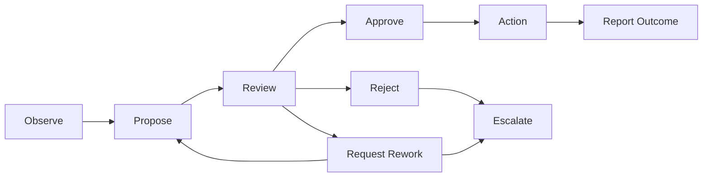

# Actor Communication Protocol

AI Organization Framework における Actor 間通信の標準仕様。

## Purpose

この文書は、`Observe`、`Propose`、`Review`、`Approve`、`Reject`、`Request Rework`、`Report Outcome`、`Escalate` を traceable な message model として定義する。

目的は次の 3 つ。

1. governance を自然言語の雰囲気で終わらせない
2. decision の根拠を message trace として辿れるようにする
3. runtime と human review の両方で扱える最小 protocol を作る

## Scope

この protocol は Actor 間通信に適用する。  
user clarification は関連するが、ここでは外部入力として扱う。

## Normative Message Types

次の 8 種を normative set とする。

1. `Observe`
2. `Propose`
3. `Review`
4. `Approve`
5. `Reject`
6. `Request Rework`
7. `Report Outcome`
8. `Escalate`

## Common Envelope

すべての message は最低限次を持つ。

- `message_id`
- `thread_id`
- `session_id`
- `message_type`
- `sender_actor`
- `recipient_actor` or `recipient_group`
- `decision_scope`
- `timestamp`
- `summary`

必要なら次も持てる。

- `decision_id`
- `related_message_id`
- `artifacts`
- `policy_refs`
- `rule_refs`
- `evidence_refs`
- `context_snapshot_id`

## Traceability Rule

通信は thread として追跡できなければならない。

最低限の追跡単位:

1. `session_id`
2. `thread_id`
3. `message_id`

`Decision Record` が存在する場合、関連 message は同じ `decision_id` または `thread_id` に結び付けられる必要がある。

## Type-Specific Requirements

### Observe

目的:

- 事実、signal、constraint、risk、current state を共有する

最低限必要:

- `observation`
- `evidence_refs` or `source`

### Propose

目的:

- option を正式提案する

最低限必要:

- `proposal_title`
- `proposal_summary`
- `rationale`
- `expected_artifact`
- `expected_outcome`

あるとよい:

- `policy_tradeoffs`
- `forecast_summary`

### Review

目的:

- proposal を評価する

最低限必要:

- `target_message_id`
- `review_summary`
- `assessment`

`assessment` は少なくとも次のどれかを含む。

- value fit
- feasibility fit
- risk concern

### Approve

目的:

- governance 上有効な承認を記録する

最低限必要:

- `target_message_id`
- `approval_scope`
- `rationale`

承認は理由なしに行ってはならない。

### Reject

目的:

- proposal または review result を退ける

最低限必要:

- `target_message_id`
- `rejection_reason`
- `rule_or_policy_basis`

reject は単なる不同意ではなく、rule、policy、risk、scope mismatch のどれかに根拠を持つ。

### Request Rework

目的:

- 却下ではなく修正要求を返す

最低限必要:

- `target_message_id`
- `required_changes`
- `acceptance_condition`

### Report Outcome

目的:

- action 後の artifact と outcome を報告する

最低限必要:

- `target_message_id` or `decision_id`
- `artifact_result`
- `outcome_result`
- `evidence_refs`

必要なら次も含める。

- `change_trigger`
- `reopen_recommendation`

### Escalate

目的:

- deadlock、timeout、ownership ambiguity を上位判断へ送る

最低限必要:

- `target_message_id` or `thread_id`
- `escalation_reason`
- `deadlock_summary`
- `remaining_options`
- `escalation_target`

## Governance Binding

message が存在しても、それだけでは decision は成立しない。  
decision は governance model が要求する message 条件を満たしたときだけ成立する。

例:

- `Council of Three`: required approvals と veto condition が満たされたとき成立
- `single-owner-with-review`: owner approval と mandatory review 完了で成立
- `fast-track`: builder execution と minimal review で成立

## Decision Record Binding

`Decision Record` は少なくとも次を参照できるとよい。

- `Protocol Thread ID`
- key proposal message
- key approval or rejection message
- escalation message if any

message log が詳細、`Decision Record` が圧縮要約、という関係で使う。

## State Pattern

標準的な流れは次である。



## Minimal Examples

### Proposal

```json
{
  "message_id": "msg-001",
  "thread_id": "thr-req-001",
  "session_id": "sess-001",
  "message_type": "Propose",
  "sender_actor": "Builder",
  "recipient_group": "Council",
  "decision_scope": "Requirements approval",
  "summary": "Reduce mandatory onboarding fields",
  "proposal_title": "Option A",
  "proposal_summary": "Halve required registration fields",
  "rationale": "Directly reduces entry friction with low implementation risk",
  "expected_artifact": "requirements note and code change set",
  "expected_outcome": "higher sign-up completion rate"
}
```

### Reject

```json
{
  "message_id": "msg-007",
  "thread_id": "thr-req-001",
  "session_id": "sess-001",
  "message_type": "Reject",
  "sender_actor": "Guardian",
  "recipient_actor": "Builder",
  "decision_scope": "Requirements approval",
  "target_message_id": "msg-001",
  "summary": "Reject guest-flow proposal",
  "rejection_reason": "Authentication exception handling is undefined",
  "rule_or_policy_basis": "Quality and safety policy requires explicit failure containment"
}
```

### Escalate

```json
{
  "message_id": "msg-012",
  "thread_id": "thr-req-001",
  "session_id": "sess-001",
  "message_type": "Escalate",
  "sender_actor": "Facilitator",
  "recipient_actor": "Human Maintainer",
  "decision_scope": "Requirements approval",
  "summary": "Deadlock after repeated rework",
  "escalation_reason": "Max retries exceeded",
  "deadlock_summary": "Builder and Guardian disagree on acceptable auth simplification",
  "remaining_options": [
    "limit scope to field reduction only",
    "accept deeper auth redesign",
    "stop current proposal"
  ],
  "escalation_target": "Human Maintainer"
}
```
