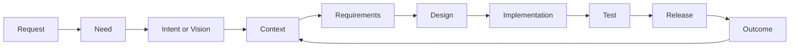
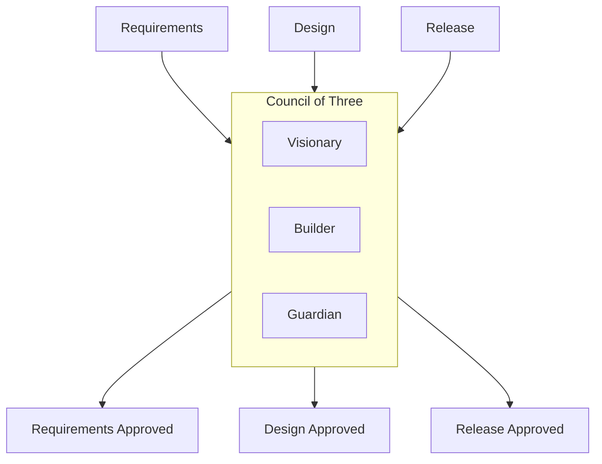

# AIDLC Pilot

この文書は、AI Organization Framework をソフト開発に適用して検証するための最小パイロット案である。

## 狙い

最初に検証したいのは、「曖昧な要求から、意思決定の履歴を保ちながら、成果物と結果を一貫して追えるか」である。

## パイロットの流れ

1. `Request` を受け取る
2. `Need` `Intent/Vision` `Context` に分解する
3. 要件案を作る
4. 設計案を作る
5. 実装する
6. テストする
7. リリースする
8. `Outcome` を観測する

## AIDLC への対応

### Need

何を解決したいか。

例:

- バグ修正時間を短くしたい
- 離脱率を下げたい
- 新機能の開発速度を上げたい

### Intent

どの方向で解決するか。
AIDLC では `Vision` と呼ぶ場合があるが、このフレームワーク上は `Intent` のドメイン別表現として扱う。

例:

- UI を簡素化する
- 自動テストを増やす
- 既存設計を分割する

### Context

制約条件。

例:

- 2 週間で出す
- 既存 API は壊せない
- 人員 2 名
- セキュリティ監査必須

### Artifact

追跡対象となる成果物。

例:

- 要件メモ
- 設計書
- コード差分
- テスト結果
- リリースノート

### Outcome

成果物の外部結果。

例:

- バグ再発率が下がった
- デプロイ失敗率が下がった
- 機能利用率が上がった

## Actor 例

- Visionary: 何を達成すべきかを見る
- Architect: どう設計するかを見る
- Builder: どう実装するかを見る
- Reviewer: 品質と破綻リスクを見る
- Release Owner: 出荷可否を見る

小規模チームでは、1 Actor が複数 Role を兼任してよい。
ここでの名前は Actor 名として使っても Role 名として使ってもよい。正式な記録では、実体である Actor と責務である Role を分ける。

## Council の使い方

最低限、次の 3 点で承認を取る。

1. Requirements 承認
2. Design 承認
3. Release 承認

このとき Council of Three を使うなら、各観点は次の通り。

- Visionary: Need と Intent に合っているか
- Builder: 期限、工数、技術で成立するか
- Guardian: 品質、安全、運用リスクに問題がないか

## 成功条件

このパイロットが成功といえる最低条件は次の通り。

1. すべての作業が `Need` `Intent` `Context` から説明できる
2. 各承認点に `Decision` の記録がある
3. Artifact と担当 Actor を対応づけられる
4. リリース後に `Outcome` を観測できる
5. `Outcome` に基づいて次の `Context` を更新できる
6. 必要なら `Need` または `Intent` の再解釈に戻れる

## 最初の検証テーマ

最初は大規模案件ではなく、次のような小さな変更が向いている。

- 既存機能の改善
- 単独機能の追加
- 明確なバグ修正

理由は、Artifact と Outcome の因果を追いやすいからである。

## 次に詰めるべきこと

1. `Policy` の標準軸と重み表現
2. `Request -> Need` 解釈の品質基準
3. `Outcome` の測定指標
4. `Decision Record` を実案件で回したときの記録負荷

`Decision Record` の標準テンプレートは [docs/decision-record-template.md](/Users/mn/Documents/Codex/2026-05-30/ai-ai-organization-framework-ai-ai/docs/decision-record-template.md:1) を使う。
