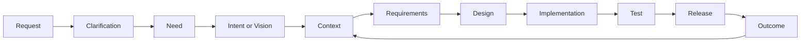
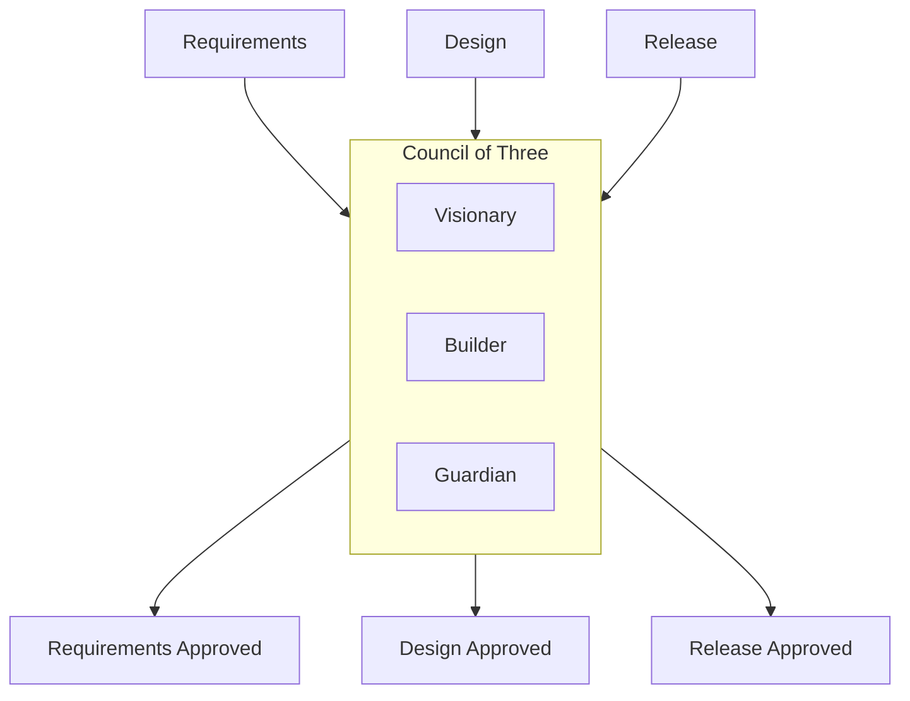

# AIDLC Pilot

この文書は、AI Organization Framework をソフト開発に適用して検証するための最小パイロット案である。

## 狙い

最初に検証したいのは、「曖昧な要求から、意思決定の履歴を保ちながら、成果物と結果を一貫して追えるか」である。

実施済みの最初の pilot record は [docs/aidlc-pilot-record-001.md](docs/aidlc-pilot-record-001.md) を参照する。  
検証結果のまとめは [docs/aidlc-pilot-validation.md](docs/aidlc-pilot-validation.md) に置く。

このため、AIDLC パイロットでも `Clarification` は標準フェーズとして扱う。  
曖昧な request をそのまま `Need` に変換せず、質問、既存資料確認、前提の明示を挟んでから framing に入る。

`Clarification` の exit 条件は [docs/clarification-phase.md](docs/clarification-phase.md) に従う。

既存案件を対象にする場合は、ここで onboarding 仕様の経緯、既存コード、過去の制約、未解決課題などの `Orientation` を先に行う。
`Orientation` の exit 条件は [docs/orientation-phase.md](docs/orientation-phase.md) に従う。

## パイロットの流れ

1. `Request` を受け取る
2. 必要なら `Clarification` で利用者や既存資料に確認する
3. `Need` `Intent/Vision` `Context` に分解する
4. 要件案を作る
5. 設計案を作る
6. 実装する
7. テストする
8. リリースする
9. `Outcome` を観測する

## AIDLC への対応

### Need

何を解決したいか。

例:

- バグ修正時間を短くしたい
- 離脱率を下げたい
- 新機能の開発速度を上げたい

### Intent

どの方向で解決するか。
AIDLC では `Vision` と呼ぶ場合があるが、このフレームワーク上は `Intent` のドメイン別表現として扱う。

例:

- UI を簡素化する
- 自動テストを増やす
- 既存設計を分割する

### Context

制約条件。

例:

- 2 週間で出す
- 既存 API は壊せない
- 人員 2 名
- セキュリティ監査必須

これらは `Context` であって、常に必須の `Estimate` ではない。  
必要な場合だけ `Forecast` として扱う。

### Artifact

追跡対象となる成果物。

例:

- 要件メモ
- 設計書
- コード差分
- テスト結果
- リリースノート

### Outcome

成果物の外部結果。

例:

- バグ再発率が下がった
- デプロイ失敗率が下がった
- 機能利用率が上がった

### External Signal

成果物とは独立に外部から入る変化。

例:

- 顧客要求変更
- 依存 API の仕様変更
- 監査条件の追加
- 本番障害

## Actor 例

- Visionary: 何を達成すべきかを見る
- Architect: どう設計するかを見る
- Builder: どう実装するかを見る
- Reviewer: 品質と破綻リスクを見る
- Release Owner: 出荷可否を見る

小規模チームでは、1 Actor が複数 Role を兼任してよい。
ここでの名前は shorthand として Actor 名のように書いてよいが、正式な記録では、実体である Actor と責務である Role を分ける。Role の正式扱いは [docs/role-model.md](docs/role-model.md) を使う。

AI worker を使う場合は、`Capability` だけでなく `Performance Profile` と `Capacity` も見る。  
例として、速度が高くても review load が高い actor は release-critical task に不向きなことがある。

## Council の使い方

最低限、次の 3 点で承認を取る。

1. Requirements 承認
2. Design 承認
3. Release 承認

このとき Council of Three を使うなら、各観点は次の通り。

- Visionary: Need と Intent に合っているか
- Builder: 期限、工数、技術で成立するか
- Guardian: 品質、安全、運用リスクに問題がないか

## 成功条件

このパイロットが成功といえる最低条件は次の通り。

1. すべての作業が `Need` `Intent` `Context` から説明できる
2. 各承認点に `Decision` の記録がある
3. Artifact と担当 Actor を対応づけられる
4. リリース後に `Outcome` を観測できる
5. `Outcome` に基づいて次の `Context` を更新できる
6. 必要なら `Need` または `Intent` の再解釈に戻れる

## Completion と Success

AIDLC では、各工程で `Completion Criteria` を置き、リリース後または運用後に `Success Criteria` を評価する。

例:

- Requirements completion: 要件が承認され、決定記録が残っている
- Release completion: 実装が出荷され、所定のテストと承認を通過している
- Product success: KPI、障害率、利用率などの outcome 指標が改善している

したがって、release 完了と product success は別である。  
パイロットでは、最低 1 つの decision について両方を記録できることを検証対象にする。

## 最初の検証テーマ

最初は大規模案件ではなく、次のような小さな変更が向いている。

- 既存機能の改善
- 単独機能の追加
- 明確なバグ修正

理由は、Artifact と Outcome の因果を追いやすいからである。

## 次に詰めるべきこと

1. `Request -> Need` 解釈の品質基準
2. `Outcome` の測定指標
3. `Decision Record` を実案件で回したときの記録負荷
4. code-heavy task で second pilot を回したときの差分

`Policy` の標準軸と表現は [docs/policy-model.md](docs/policy-model.md) を使う。  
`Decision Record` の標準テンプレートは [docs/decision-record-template.md](docs/decision-record-template.md) を使う。
`Completion Criteria` と `Success Criteria` の分離は [docs/completion-success-model.md](docs/completion-success-model.md) を使う。
`Forecast` の扱いは [docs/forecast-model.md](docs/forecast-model.md) を使う。
`External Signal` の扱いは [docs/external-signal-model.md](docs/external-signal-model.md) を使う。
`Performance Profile` と `Capacity` の扱いは [docs/performance-capacity-model.md](docs/performance-capacity-model.md) を使う。
governance template の規範強度は [docs/governance-template-model.md](docs/governance-template-model.md) を使う。
context lifecycle は [docs/context-lifecycle-model.md](docs/context-lifecycle-model.md) を使う。
machine-readable decision log profile は [docs/decision-log-profile.md](docs/decision-log-profile.md) を使う。
