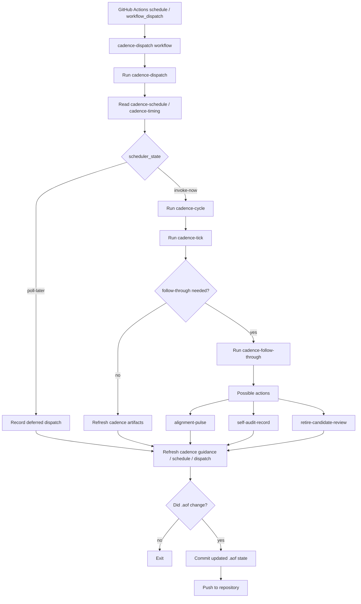

# Cadence Runtime Model

`cadence` は、AOF が repo 自体の運用状態を**定期的に点検し、必要なら整えるための runtime loop** である。

`v1.9.0` 以降の self-hosting cycle では、cadence は単なる方針や note ではなく、

- runtime command
- first-class artifact
- external scheduler binding

を持つ operating surface になっている。

## What Cadence Means

ここでの `cadence` は次を扱う。

- alignment pulse
- task triage
- stale-task review
- framework self-audit
- scheduler binding and follow-through

言い換えると、cadence は **AOF の定期チェック運用** である。

## Why Cadence Exists

main lifecycle command が project memory を自然更新できても、それだけでは長い運用で次の問題が残る。

- open task が古くなる
- 方向性のずれが静かに溜まる
- self-audit が release 前にしか回らない
- operator が「いつ見直すべきか」を思い出し続ける必要がある

cadence はこの gap を埋めるための loop である。

## Core Cadence Surfaces

cadence runtime の中心は次の artifact である。

- `.aof/context/active/alignment-pulse.json`
- `.aof/context/active/cadence-trigger-guidance.json`
- `.aof/context/active/cadence-follow-through.json`
- `.aof/context/active/cadence-timing.json`
- `.aof/context/active/cadence-tick.json`
- `.aof/context/active/cadence-cycle.json`
- `.aof/context/active/cadence-schedule.json`
- `.aof/context/active/cadence-dispatch.json`
- `.aof/context/active/cadence-scheduler-binding.json`
- `.aof/context/active/cadence-scheduler-profile.json`
- `.aof/context/active/retire-candidate-review.json`
- `.aof/context/active/framework-self-audit.json`

これらは raw log ではなく、**今の cadence state を人間と runtime が共有するための current-state artifact** である。

## Command Roles

cadence 系 command の役割は次のとおり。

### Review Commands

- `alignment-pulse`
  - alignment / task triage / stale-task check を更新する
- `self-audit-record`
  - self-audit を active artifact として記録する
- `retire-candidate-review`
  - retire candidate task を `keep-open` または `retired` に進める

### Guidance Commands

- `cadence-trigger-guide`
  - 次にどの cadence action が必要かを判断する
- `cadence-scheduler-binding`
  - cron / GitHub Actions / agent loop の binding guidance を出す
- `cadence-scheduler-profile`
  - production profile を選択する

### Execution Commands

- `cadence-follow-through`
  - supported cadence action を実行する
- `cadence-tick`
  - cadence が due か、follow-through が必要かを判断する
- `cadence-cycle`
  - `due-now` なら `cadence-tick` を self-start する
- `cadence-schedule`
  - external scheduler 向けに `invoke-now | poll-later` を出す
- `cadence-dispatch`
  - external scheduler entrypoint として `cadence-cycle` を呼ぶ

## Current Production Scheduler Profile

現在の primary production profile は `github_actions` である。

active artifact:

- `.aof/context/active/cadence-scheduler-profile.json`

workflow:

- [/.github/workflows/cadence-dispatch.yml](../.github/workflows/cadence-dispatch.yml)

dispatch command:

```bash
node ./src/cli.js cadence-dispatch --project . --stale-after-hours 24
```

## Current GitHub Actions Flow



## Current State After TASK-004

`TASK-004` で成立したこと:

- cadence timing is runtime-visible
- cadence follow-through is runtime-backed
- cadence can self-start inside runtime through `cadence-cycle`
- external scheduler contract exists through `cadence-schedule`
- dispatch surface exists through `cadence-dispatch`
- GitHub Actions is selected as the primary production scheduler profile
- a live GitHub Actions cadence-dispatch run has been observed successfully

関連監査:

- [framework-self-audit-021.md](./framework-self-audit-021.md)
- [framework-self-audit-022.md](./framework-self-audit-022.md)

## Current Remaining Gap

cadence runtime 自体はかなり成立している。  
今の gap は **runtime の不足** ではなく **human visibility** である。

現状では、

- cadence timing
- cadence dispatch state
- selected scheduler profile

を確認するには raw `.aof/context/active/*.json` artifact を直接読む必要がある。

そのため次の focus は、これらの cadence state を **existing human visibility contract** に載せることにある。

## Related Tasks

- done: `TASK-004` — make alignment pulse and task triage cadence lifecycle-native
- open: `TASK-005` — expose cadence scheduler state in human visibility outputs
