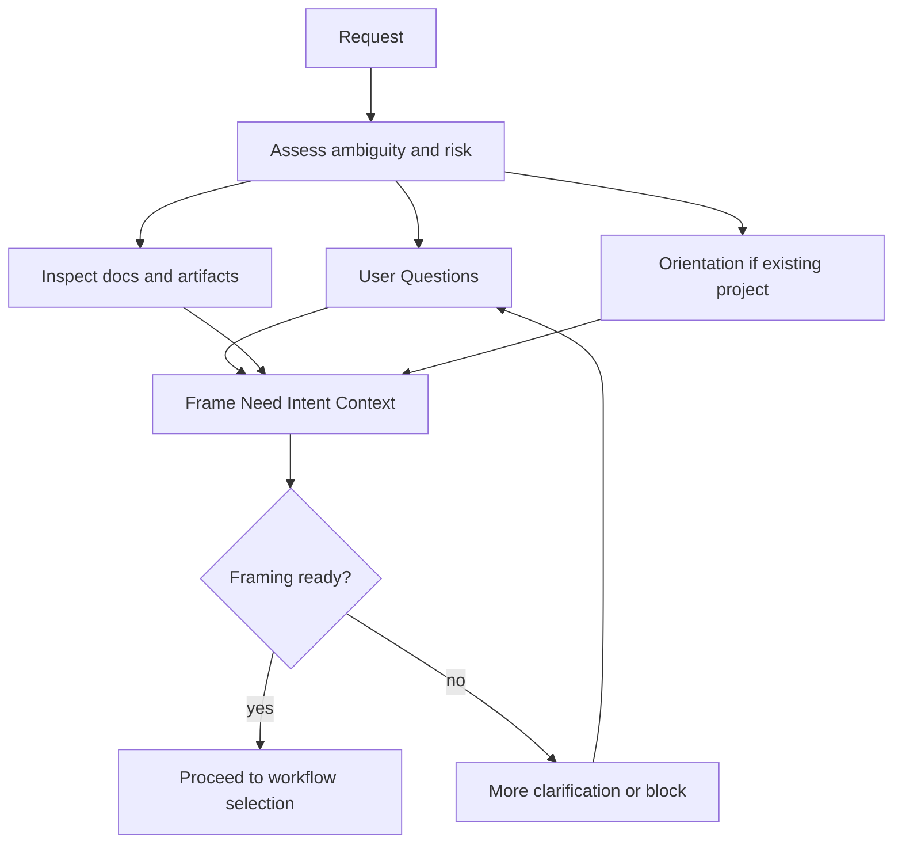

# Clarification Phase

AI Organization Framework における `Clarification` の仕様。

## 位置づけ

`Clarification` はコア概念ではなく、標準の運用フェーズである。  
役割は、`Request` から `Need` `Intent` `Context` を安全に framing できる状態へ進めることにある。

`Discovery` は別フェーズではない。  
`Clarification` の中で行う手法の 1 つとして扱う。

## 目的

`Clarification` は次のために行う。

- 曖昧な request を減らす
- 前提の欠落を埋める
- 制約、禁止条件、成功条件を確認する
- 勝手な危険解釈を防ぐ
- 既存案件では背景や経緯を把握する

## 手法

`Clarification` では次の手法を使える。

- 利用者への質問
- 既存資料の確認
- 既存 Artifact の確認
- 過去の意思決定の確認
- 既存案件に対する `Orientation`

このため、`Clarification` は会話だけを意味しない。

## Mandatory Conditions

次のいずれかに当てはまる場合、`Clarification` は省略してはならない。

1. request が複数解釈可能
2. 制約条件が不足している
3. 成功条件や禁止条件が不明
4. 既存案件に途中参加する
5. high-stakes な判断を含む
6. 既存資料同士に矛盾がある

## Skippable Conditions

次の条件がそろう場合、`Clarification` は短縮または実質省略してよい。

1. request が単義的
2. `Need` `Intent` `Context` が既に十分記述されている
3. 制約と成功条件が明示済み
4. 既存案件であっても orientation 情報が最新で信頼できる

## Required Outputs

`Clarification` を終えるには、最低限次の出力が必要である。

1. framed `Need`
2. framed `Intent`
3. usable `Context`
4. `Clarifications or Assumptions`
5. 既存案件なら `Background or Prior Decisions`

## Framing Readiness

次の条件を満たしたとき、runtime または組織は `Clarification` から次の工程へ進める。

1. request source が特定されている
2. 誰の need を扱うかが明確
3. intent の方向性が 1 つ以上の候補として明示されている
4. 現時点の制約が context に入っている
5. 残る不確実性が assumptions として記録されている
6. governance scope が分かる

## Failure Modes

`Clarification` で止まるべきパターン。

- request の主体が不明
- 制約が矛盾している
- 成功条件がゼロで判断基準を置けない
- 既存案件の状態が不明で action が危険

この場合は framing に進まず、追加質問、追加調査、Issue 化、または blocked 扱いにする。

## Relationship to Orientation

`Orientation` は、既存案件に適用する場合の `Clarification` のサブモードである。  
greenfield では必須ではないが、brownfield では通常必要になる。

`Orientation` の詳細は [docs/orientation-phase.md](docs/orientation-phase.md) を参照する。

## Decision Record Connection

`Clarification` の結果は少なくとも次の 2 項目へ落とす。

- `Background or Prior Decisions`
- `Clarifications or Assumptions`

必要に応じて `Context` も更新する。

## Workflow

## Examples

### Greenfield

- Request: 初回離脱率を下げたい
- Clarification: 何を離脱と定義するか、どこまでが初回体験か、制約は何かを質問する
- Output: `Need`, `Intent`, `Context`, `Clarifications or Assumptions`

### Brownfield

- Request: onboarding を改善したい
- Clarification: 既存 onboarding の履歴、現行コード、過去の判断、既知制約を確認する
- Output: `Background or Prior Decisions`, `Context`, `Clarifications or Assumptions`
