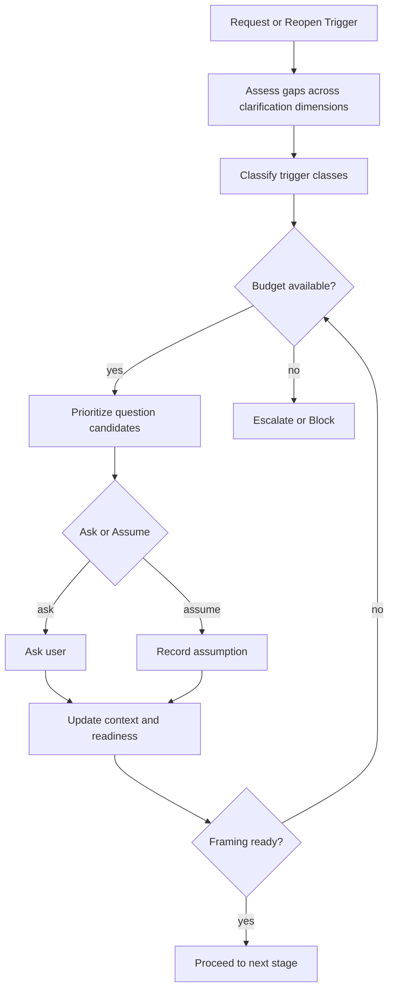

# Clarification Question Selection

AI Organization Framework における `Clarification` 質問選択ロジックの正式仕様。

## Purpose

runtime が `Clarification` で何を人間に聞くべきかを、再現可能に判断できるようにする。

ここで決めるのは次の 3 点である。

1. 何が欠けていると質問が必要か
2. 複数の候補質問のうち何を先に聞くか
3. どこで質問を打ち切り、assumption で先へ進むか

## Position

この文書は [docs/clarification-phase.md](docs/clarification-phase.md) の補助ではなく、その runtime 実装規則である。  
`Clarification Phase` が `いつ必要か` を定め、ここでは `何をどう聞くか` を定める。

## Core Rule

runtime は思いつきで質問してはならない。  
質問は常に、framing readiness を妨げている欠落、曖昧さ、矛盾、または high-stakes risk に紐づいていなければならない。

## Clarification Dimensions

runtime は request を最低限次の観点で評価する。

1. `Need clarity`
2. `Intent clarity`
3. `Context completeness`
4. `Success criteria clarity`
5. `Prohibited conditions clarity`
6. `Governance scope clarity`
7. `Brownfield orientation completeness optional`
8. `Risk exposure`

各観点は `clear` `partial` `missing` `conflicting` のいずれかで記録してよい。

## Trigger Classes

runtime が質問を作るべき直接理由は次とする。

1. `ambiguity`
2. `missing-constraint`
3. `missing-success-criteria`
4. `missing-prohibition`
5. `governance-unclear`
6. `brownfield-gap`
7. `high-stakes-risk`
8. `source-conflict`

## Question Candidate Rule

runtime はまず「欠けているもの」を先に作り、その後に質問文を生成する。

順序:

1. gap を特定する
2. gap を trigger class に分類する
3. 最小質問単位へ落とす
4. answer によって更新される field を明示する

1 つの質問は原則として 1 つの主要 gap に対応させる。  
複数の独立 gap を 1 問に詰め込んではならない。

## Prioritization Rule

候補質問が複数ある場合、runtime は次の優先順で並べる。

1. safety, legal, security, irreversible change に関わる質問
2. success criteria または prohibited conditions を確定する質問
3. `Need` と `Intent` の取り違えを防ぐ質問
4. hard constraint を確定する質問
5. brownfield で現状誤読を防ぐ質問
6. optimization や preference に関する質問

同順位なら次で tie-break する。

1. 1 問で複数 field が更新されるものを優先
2. governance scope を早く確定できるものを優先
3. runtime が安全に assumption を置けないものを優先

## Ask vs Assume Rule

runtime は、欠落があるたびに必ず質問する必要はない。  
次の条件をすべて満たす場合は assumption を置いて先へ進めてよい。

1. high-stakes ではない
2. reversible である
3. policy conflict を生まない
4. 後工程で再確認可能
5. assumption の内容が Decision Record または session state に残せる

次の条件のいずれかに当てはまる場合は質問を省略してはならない。

1. safety, legal, security に関わる
2. success criteria が 0 のままになる
3. hard constraint を誤ると大きな手戻りになる
4. brownfield で現状把握を誤る危険が高い
5. governance owner が曖昧なままになる

## Question Budget

runtime は clarification を無限に続けてはならない。  
標準では次の budget を持つ。

1. `initial_question_budget`: 3
2. `followup_budget`: 2
3. `max_rounds`: 3

これは絶対固定値ではなく template policy で調整してよい。  
ただし budget 超過時は、次のいずれかを明示しなければならない。

1. proceed with assumptions
2. escalate to human actor
3. stop as blocked

## Stop Rule

runtime は次のいずれかで clarification question generation を止める。

1. framing readiness を満たした
2. これ以上の質問が low-value になった
3. remaining gaps が assumption で安全に吸収できる
4. budget を超え、escalation または blocked が必要

## Output Contract

question generation の出力は最低限次を持つ。

1. `questions`
2. `question_rationale`
3. `trigger_classes`
4. `target_fields`
5. `ask_or_assume_decision`
6. `remaining_gaps`
7. `next_stop_condition`

## Suggested Question Shape

質問は短く、答えが framing に直接効く形が望ましい。

好ましい例:

- 初回離脱とは、どの時点での離脱を指しますか
- 今回は何を変えてはいけませんか
- 成功したと判断する指標は何ですか

避ける例:

- 何か他にありますか
- どうしたいですか
- 全体的に詳しく教えてください

## Session Persistence

session には最低限次を残す。

- asked questions
- question rationale
- trigger class
- target fields
- user answers
- assumptions used instead of asking
- unresolved gaps
- clarification round count

## Decision Record Connection

Decision Record には最低限次を落とせるようにする。

- `Clarifications or Assumptions`
- `Routing Mode`
- `Escalation Target optional`
- `Change Trigger optional`

必要なら次も持ってよい。

- `Clarification Summary optional`
- `Unresolved Ambiguity optional`

## Runtime Flow

## Example

request: `初回離脱率を下げたい`

detected gaps:

- success criteria clarity: missing
- prohibited conditions clarity: partial
- context completeness: partial

selected questions:

1. 初回離脱とは、どの時点での離脱を指しますか
2. 今回、変更してはいけない既存要素はありますか
3. 改善成功は何の指標で判断しますか

assumptions not allowed:

- success criteria を runtime が勝手に決める
- 認証基盤変更可否を未確認のまま進む

## Relation to Issue #22

この文書は `#22 clarification-question selection logic` の正本である。  
packet 構造は [docs/model-input-assembly.md](docs/model-input-assembly.md)、stage owner は [docs/stage-role-matrix.md](docs/stage-role-matrix.md) を参照する。
