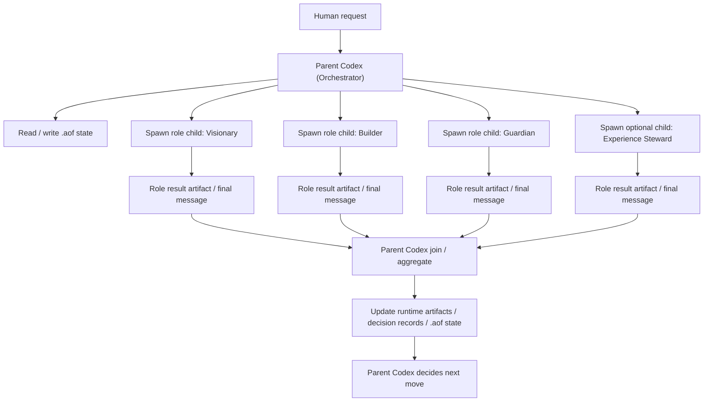

# Codex Parent/Child Orchestration Model

この文書は、**現行 Codex 仕様で実装可能な AOF parent/child orchestration** を定義する。

目的は 2 つである。

1. Codex がどこまで Orchestrator として role execution を束ねられるかを明示する
2. できる loop と、まだ未実装な loop を混同しないようにする

## Position

現行 Codex 仕様では、

- **Human が起動した親 Codex セッション**
- **親が spawn する child agent 群**

による parent/child orchestration は可能である。

ただし、

- GitHub Actions が Codex parent を自律起動する
- runtime が Codex parent を headless worker として直接再起動する

という loop は、現行の確認済み仕様としては置かない。

## What Is Actually Possible

### Possible Now

現行 Codex 仕様で可能なのは次である。

1. Human が親 Codex に依頼する
2. 親 Codex が `.aof/` state を読む / 書く
3. 親 Codex が role ごとに child agent を spawn する
4. child agent が role result を返す
5. 親 Codex が join / aggregate する
6. 親 Codex が runtime artifact を更新する

### Not Yet Proven As Current Codex Operating Reality

現時点で proven architecture としては置かないもの:

1. GitHub Actions -> Codex parent 自動起動
2. runtime -> Codex parent 自動再開
3. unattended continuous loop where Codex self-starts from scheduler events

## Current Operating Shape



## Runtime Boundary

このモデルでは、runtime は parent Codex の外にある deterministic substrate として扱う。

- runtime:
  - state mutation
  - persistence
  - deterministic command execution
  - cadence surfaces
- parent Codex:
  - orchestration
  - join logic
  - human-facing interpretation
  - next-step decision
- child agents:
  - role-scoped reasoning / implementation / review

## Parent/Child Role Result Contract

child agent が親へ返す最小 contract は次である。

```json
{
  "result_type": "role-result",
  "role": "guardian",
  "stage": "approval",
  "session_id": "SESS-GUARD-001",
  "status": "completed",
  "recommendation": "request_changes",
  "rationale": "blast radius is not yet bounded enough for fast-track approval",
  "signals": [
    "governance-risk"
  ],
  "artifact_refs": [
    ".aof/decisions/DEC-214.json"
  ],
  "decision_required": true
}
```

## Parent Join Contract

親 Codex が join 時に見る最小情報は次である。

```json
{
  "join_type": "role-join",
  "expected_roles": [
    "visionary",
    "builder",
    "guardian"
  ],
  "received_roles": [
    "visionary",
    "builder",
    "guardian"
  ],
  "missing_roles": [],
  "aggregate_state": "ready-for-orchestrator-decision",
  "blocking_signals": [
    "governance-risk"
  ],
  "recommended_next_step": "write decision record and escalate to human review"
}
```

## Practical Constraints

この方式には次の制約がある。

### 1. Parallel Is Not Equal To Independence

child を並列起動しても、

- 同じ model family
- 同じ parent context
- 同じ orchestration policy

なら、strong independence claim は別評価である。

### 2. Parent Remains Interactive

親 Codex は **Human-started interactive orchestrator** である。  
したがって、今のところこの loop は

- unattended scheduler-native AI loop

ではなく、

- human-started Codex orchestration loop

である。

### 3. GitHub Actions Is Not The Parent

GitHub Actions は現時点では

- cadence scheduler
- deterministic runtime trigger

としては使えるが、Codex parent の代わりではない。

## Relation To Future Work

この文書は、現行 Codex 仕様で可能な範囲を固定する。

次の設計論点は別である。

1. GitHub Actions or another scheduler が Codex parent invocation packet をどう作るか
2. Codex parent をどの runtime / environment で受けるか
3. parent/child orchestration result を `.aof/` current state へどう還流するか

つまり次の段階は、

- parent/child orchestration itself

ではなく、

- **scheduler-to-parent invocation bridge**

である。
