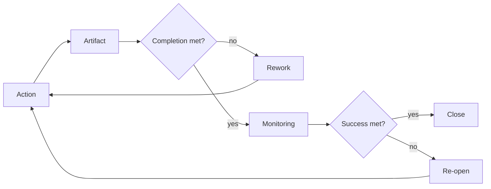
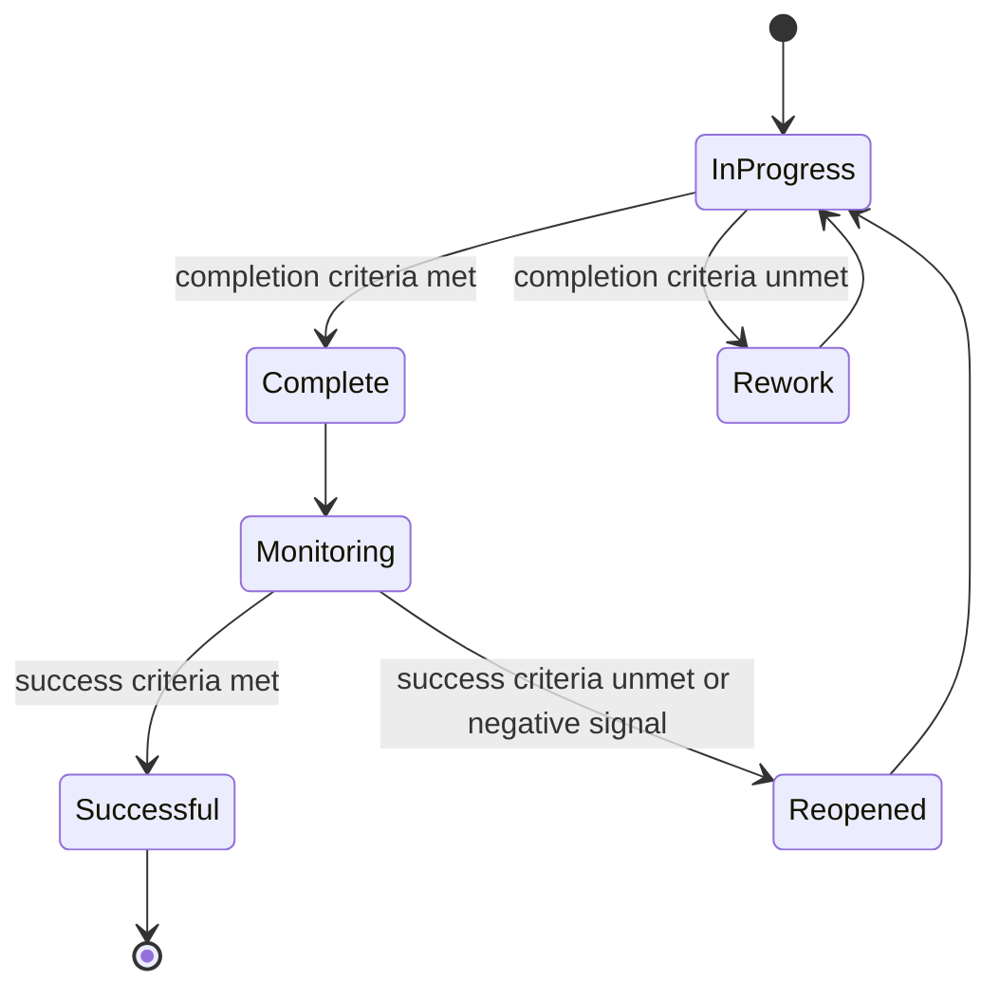

# Completion and Success Model

AI Organization Framework における `Completion Criteria` と `Success Criteria` の分離仕様。

## 位置づけ

`Artifact` と `Outcome` は既に別概念である。  
この仕様では、それに対応して `Done` と `Success` も別に扱う。

- `Completion` は Artifact-level の完了状態
- `Success` は Outcome-level の達成状態

## Definitions

### Completion Criteria

`Completion Criteria` は、Artifact が所定の条件を満たして「done」とみなせる条件である。

例:

- コードが merge 済み
- テストが通っている
- 要件書が承認済み
- 図面が提出済み

### Success Criteria

`Success Criteria` は、Outcome が期待した外部結果を満たして「successful」とみなせる条件である。

例:

- 離脱率が 5% 以上改善
- 障害率が下がる
- 学習定着率が改善
- 満足度が上がる

## Core Rule

次を原則とする。

1. 完成していても成功とは限らない
2. 成功していても、形式上は未完了の Artifact が残る場合がある
3. `Decision Record` には両方を独立して書く
4. completion approval と success evaluation は別 governance scope でよい

## Canonical States

最低限、次の 4 状態を区別する。

1. `Not Complete / Not Successful`
2. `Complete / Not Yet Successful`
3. `Complete / Successful`
4. `Partially Complete / Successful Enough`

4 は、完全な仕上がりではないが、目的達成のためには十分で、追加作業を止める合理性がある状態を指す。

## Governance Rule

通常は次のように分ける。

- `Completion` はその工程の governance scope が承認する
- `Success` は outcome owner か monitoring scope が評価する

例:

- Requirements completion は requirements approval が決める
- Release completion は release governance が決める
- Business success は product owner や operating team が評価する

このため、release approved と business successful は別でよい。

## Decision Record Rule

`Decision Record` には最低限次を記録する。

1. `Completion Criteria`
2. `Success Criteria`
3. `Completion Approval Scope`
4. `Success Evaluation Scope`
5. `Review Trigger`

これにより、「何をもって作業完了としたか」と「何をもって成果達成としたか」を分離できる。

## Review Rule

`Completion` を満たした直後に session を閉じるとは限らない。  
`Success Criteria` が後追い観測でしか分からない場合、session は monitoring に移る。

原則:

1. `Completion` 達成後は `Monitoring` へ進めてよい
2. `Success` 未達なら reopen できる
3. `Success` 観測不能な短期案件では、proxy metric や bounded review window を置いてよい

## Proxy Rule

短期案件や観測困難案件では、`Success Criteria` を直接測れないことがある。  
その場合は proxy を認める。

例:

- 本番 KPI の代わりに staging acceptance を一時 proxy にする
- 学習成果の代わりに completion rate を短期 proxy にする

proxy を使う場合は、`Decision Record` に明示する。

## Workflow

## Lifecycle

## Examples

### Complete but Unsuccessful

- Artifact: onboarding redesign shipped
- Completion Criteria: code merged, tests passed, release approved
- Outcome: sign-up conversion did not improve
- Result: `Complete / Not Successful`

### Successful Enough with Partial Completion

- Artifact: three-step migration plan
- Completion Criteria: all three phases done
- Actual: only phase 1 shipped
- Outcome: incident rate already drops enough to stop further rollout
- Result: `Partially Complete / Successful Enough`

この場合、停止判断の governance と理由を別途記録する。
