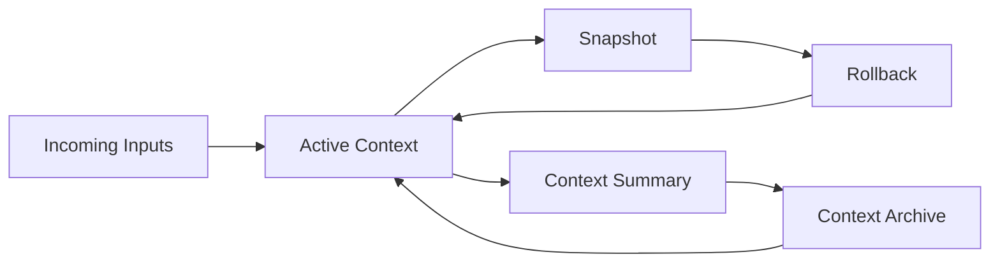

# Context Lifecycle Model

AI Organization Framework における context 管理の正式仕様。

## Purpose

context を append-only にしない。  
判断に必要な情報だけを active に保ち、残りは summary と archive に落とす。

## Layers

context は最低限次の 3 層で扱う。

1. `Active Context`
2. `Context Summary`
3. `Context Archive`

## Active Context

現在の判断に直接必要な情報。

含めるもの:

- current request framing
- current need / intent / constraints
- open risks
- current policy-sensitive assumptions
- latest relevant signals

含めすぎてはいけないもの:

- 古い全文ログ
- 既に無効化された制約
- raw artifact dump

## Context Summary

過去の判断を圧縮した中間層。

目的:

1. Active Context を軽く保つ
2. 過去判断の意味だけを残す
3. archive への入口を与える

最低限残す項目:

- summary id
- covered period or scope
- major decisions
- still-active constraints
- known invalidated assumptions
- archive references

## Context Archive

原資料の保管層。

含めるもの:

- old decision records
- old context snapshots
- obsolete summaries
- raw evidence and source material

Archive は日常判断で常時読む前提ではない。  
必要時だけ retrieval する。

## Lifecycle Events

context は次で更新される。

1. clarification result
2. orientation result
3. decision approval
4. artifact delivery
5. observed outcome
6. external signal
7. rollback

## State Transitions



## Snapshot Rule

snapshot は任意ではなく、次のタイミングで推奨ではなく標準的に作る。

1. major decision の直前
2. context compaction の直前
3. high-risk external signal を反映する直前
4. rollback の前後

snapshot は少なくとも次を持つ。

- `snapshot_id`
- `created_at`
- `decision_scope`
- `summary`
- `active_context_ref`
- `parent_snapshot_id optional`

## Rollback Rule

rollback は次の場合に許可される。

1. summary compaction が誤っていた
2. false signal を context に取り込んだ
3. invalid assumption を current truth として扱っていた

rollback のときは次を残す。

- rollback reason
- source snapshot
- replacement snapshot
- affected decisions if known

## Compaction Rule

summary 化や archive 移送は自由圧縮ではない。  
少なくとも次を守る。

1. active constraint を落とさない
2. still-open risk を落とさない
3. current policy tradeoff を落とさない
4. archive reference を消さない

## Invalidated Context Rule

古い情報は消すのではなく、invalidated として扱う。

必要なら:

- `superseded`
- `invalidated`
- `rolled_back`

のような状態を持たせてよい。

## Archivist

`Archivist` は optional standard role である。

責務:

1. summary update
2. archive promotion
3. snapshot hygiene
4. retrieval entry point maintenance
5. `.aof/tasks/done/` から `.aof/tasks/archived/` への移送
6. stale task triage の準備
7. `.aof/context/threads/` の完了出力整理

`Archivist` は意思決定主体ではない。  
context hygiene を担う補助 role である。

## Archivist Triggers

Archivist は最低限、次のどれかで起動してよい。

1. Alignment Pulse
2. Orchestrator の explicit call
3. major slice completion
4. Human manual request

## Decision Record Binding

`Decision Record` には最低限 `Context Snapshot ID` field を残す。  
snapshot がまだ存在しない段階では `null` でよい。  
必要なら summary reference も併記してよい。

この binding により、どの context state で判断したかを再現できる。

## Runtime Guidance

runtime では次の配置を推奨する。

```text
.aof/
  context/
    active/
    summaries/
    snapshots/
    archive/
```

`active` は最新状態、`summaries` は圧縮状態、`snapshots` は point-in-time restore、`archive` は長期保管を意味する。
