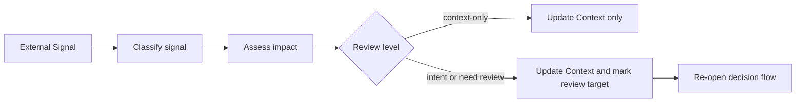
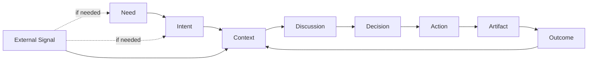

# External Signal Model

AI Organization Framework における外的変化の扱い。

## 位置づけ

`Outcome` は、自分たちの `Artifact` が現実にもたらした結果である。  
これとは別に、外部世界から入る変化を `External Signal` として扱う。

したがって次を分ける。

- `Outcome`: 自分たちの action の外部結果
- `External Signal`: 自分たちの action とは独立に入る変化

## Terminology

標準用語は `External Signal` とする。  
`Event` はその具体的な発生例または instance とみなす。

例:

- regulation change
- customer request change
- production incident
- competitor move
- market shift
- dependency deprecation

## Why Separate It

`Outcome -> Context` だけでは、次のような変化が曖昧になる。

- 顧客要求の変更
- 法規制の変更
- 外部依存 API の廃止
- 組織方針の変更
- 市場変化

これらは自分たちの成果の結果ではなく、外部から入る条件変化である。  
そのため、`Outcome` とは別に記録する。

## Core Rule

次を原則とする。

1. `External Signal` は `Outcome` と別概念
2. `External Signal` は最低でも `Context` を更新できる
3. 必要なら `Need` や `Intent` の再解釈を強制できる
4. `Decision Record` には change trigger を残す

## Update Scope

`External Signal` が更新しうる対象は次の通り。

### Context Only

例:

- 納期が前倒しになった
- 利用可能な予算が減った
- 依存バージョンが固定された

### Context and Intent Review

例:

- ユーザー要求が変わり、優先方向を見直す必要がある
- 市場状況が変わり、speed より safety を優先する必要がある

### Context, Intent, and Need Review

例:

- 経営方針が変わり、そもそもの problem framing が変わる
- 規制変更により、解くべき問題そのものが変わる

## Minimum Fields

`External Signal` を記録するときは、最低限次を持つ。

1. signal source
2. signal summary
3. affected scope
4. impact guess
5. required review level

## Signal Classes

最低限、次の class を区別できるとよい。

- `Request Change`
- `Constraint Change`
- `Risk Event`
- `Dependency Event`
- `Market Event`
- `Governance Event`

## Decision Record Rule

`Decision Record` では少なくとも次を追加する。

1. `Change Trigger`
2. 必要なら `Trigger Type`

`Change Trigger` には、何が再判断の直接原因だったかを書く。  
外的変化がない通常判断では空欄でもよい。

## Runtime Rule

runtime は monitoring 中に、`Outcome` だけでなく `External Signal` も受け取れるようにする。

原則:

1. signal intake は monitoring 中だけでなく planning 中でも起こりうる
2. signal は reopen を引き起こしてよい
2.5. `context-only` signal は reopen を必須としない
3. high-severity signal は immediate re-evaluation を要求してよい
4. signal の `required review level` が高い場合、runtime は reopen 時に `routing_mode` を `fast-track` から `deep-path` に引き上げてよい

## Workflow

## Core Loop Integration

## Examples

### Constraint Change

- Signal: security review required before release
- Effect: update `Context`
- Runtime may keep the current workflow state if the review level is only `context-only`

### Intent Review

- Signal: customer now values reliability over speed
- Effect: update `Context`, trigger `Intent` review

### Need Review

- Signal: regulation changes the core compliance requirement
- Effect: review `Need`, `Intent`, and `Context`
