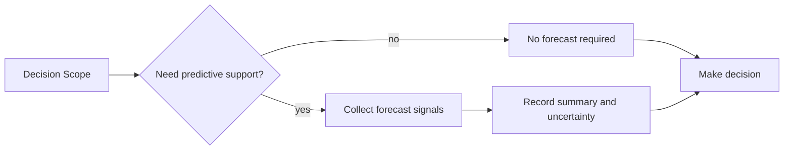
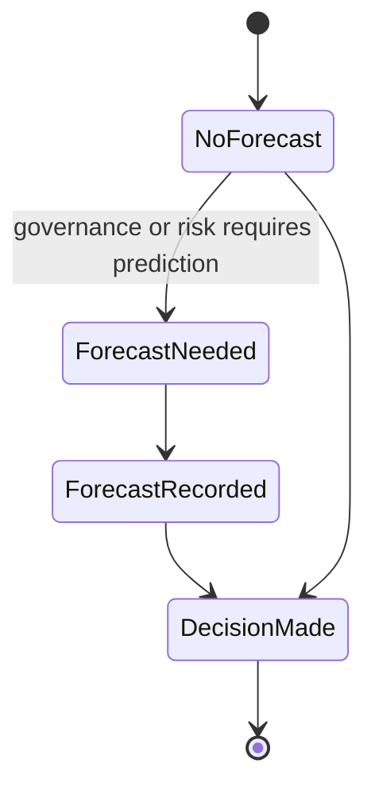

# Forecast Model

AI Organization Framework における `Forecast` の扱い。

## 位置づけ

`Estimate` はコア概念ではない。  
このフレームワークで必須なのは、意思決定に必要な予測情報であり、それを `Forecast` として扱う。

したがって、見積もりは

- 必須ではない
- 必要な案件だけ使う
- 人間中心の工数表現に固定しない

という前提にする。

## Why Forecast

意思決定で必要なのは、常に duration や headcount ではない。  
実際には次のような情報の方が重要な場合がある。

- 相対的な重さ
- 不確実性
- 再試行コスト
- レビュー負荷
- 並列化のしやすさ
- 失敗時の影響
- 再判断のタイミング

このため、`Forecast` は `Decision Support` の一部として扱う。

## Core Rule

次を原則とする。

1. `Forecast` は任意
2. ただし判断に予測情報が必要なら記録する
3. `Estimate` は `Forecast` の 1 形式であり、必須形式ではない
4. 予測情報は人間工数に限定しない

## Minimum Predictive Information

予測情報が必要な場合、最低限次のどれかを使えればよい。

1. relative effort
2. uncertainty level
3. retry cost
4. review load
5. dependency risk
6. review timing or trigger

すべてを毎回書く必要はない。  
その判断に効くものだけ使えばよい。

## Forecast Forms

`Forecast` は次のような形式を取りうる。

### Relative

- small / medium / large
- option A is heavier than option B

### Bounded

- within 2 weeks
- at most 3 review rounds

### Resource

- requires 2 human approvals
- requires parallel agent execution

### Risk

- high uncertainty due to missing production data
- retry cost is high if rollback is difficult

### Cost

- inference cost expected to stay below threshold
- operational overhead likely to increase

## Human and AI Resource Models

`Forecast` はプロジェクトに応じて resource model を変えてよい。

人間中心なら例:

- 人日
- 承認待ち時間
- 会議回数

AI 中心なら例:

- review load
- parallel run count
- context split cost
- retry cost
- inference cost

このため、duration estimate は有効だが、デフォルトではない。

## Decision Record Rule

`Decision Record` では、必要な場合だけ次を記録する。

1. `Forecast Required`
2. `Forecast Summary`
3. `Uncertainty Notes`

`Forecast Required` は `yes/no` または同等表現でよい。  
`Forecast Summary` は採用した予測形式を書く。  
`Uncertainty Notes` には、予測の弱さや前提依存を書く。

## Governance Rule

`Forecast` が required かどうかは governance scope によって決めてよい。

例:

- small local refactor では forecast 不要
- release decision では bounded forecast が必要
- high-risk migration では uncertainty note が必須

## Workflow

## Lifecycle

## Examples

### No Forecast Needed

- Decision: typo fix in internal doc
- Forecast Required: no

### AI-Centered Forecast

- Decision: split one large implementation into parallel agents
- Forecast Required: yes
- Forecast Summary: review load medium, parallel run count 3, retry cost high
- Uncertainty Notes: integration complexity depends on shared interface stability

### Human-Centered Forecast

- Decision: release candidate hardening
- Forecast Required: yes
- Forecast Summary: within 2 weeks, 2 approval gates, rollback rehearsal required
- Uncertainty Notes: schedule depends on external audit response time
