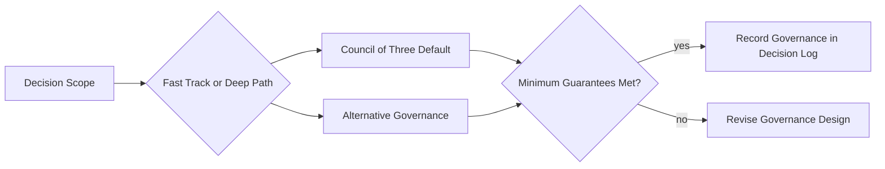

# Governance Template Model

`Council of Three` をどこまで標準化するかの補助仕様。

## Conclusion

`Council of Three` は mandatory な唯一形ではない。  
AI Organization Framework における標準ガバナンステンプレートであり、default governance pattern として扱う。

つまり、このフレームワークが必須にするのは `Council of Three` そのものではなく、意思決定組織としての minimum governance guarantees である。

## Why

`Council of Three` は次の理由で既定形として強い。

1. value
2. feasibility
3. risk

の 3 観点を、少ない seat 数で分かりやすく分離できるからである。

一方で、すべての組織、すべての workflow、すべての task に常にこの 3 席を固定するのは過剰に強い。  
fast track、single-owner approval、domain-specific governance を許容できないと、実運用で破綻しやすい。

## Normative Strength

規範強度は次の通り。

1. `Council of Three` は `recommended`
2. minimum governance guarantees は `required`
3. alternative governance models は `allowed`

## Minimum Governance Guarantees

`Council of Three` を使わない場合でも、次を満たさなければならない。

### 1. Decision Scope

- どの decision scope を扱うかが明示されている
- その scope の最終判断者が明示されている

### 2. Coverage of Three Concerns

最低限、次の 3 観点が扱われる必要がある。

- value
- feasibility
- risk

これは必ずしも 3 人 3 席を意味しない。  
seat、review gate、advisory reviewer、policy gate のどれでもよい。

### 3. Decision Rule

- majority
- owner approval
- unanimous consent
- weighted voting

のように、decision を確定する rule が明示されている必要がある。

### 4. Veto and Exception Rule

- veto の有無
- 誰が veto できるか
- 何を根拠に veto できるか
- veto conflict をどう裁定するか

を明示する必要がある。

### 5. Escalation Path

- deadlock
- timeout
- unclear risk ownership

が起きたときの escalation target を持つ必要がある。

### 6. Recordability

governance の構造が `Decision Record` に表現できる必要がある。

最低限、次が残ること。

- governance model name
- decision participants
- decision rule
- veto rule if any
- escalation target if any

## Default Council

`Council of Three` の default seat は次である。

- Visionary
- Builder
- Guardian

意味は次の通り。

- Visionary: purpose fit, value, direction
- Builder: feasibility, resource fit, delivery realism
- Guardian: quality, safety, failure containment

この triad は universal truth ではない。  
ただし、一般性が高く、AIDLC を含む複数ドメインへ写像しやすいため default template として妥当である。

runtime で各 seat をどの stage に割り当てるかは [docs/stage-role-matrix.md](docs/stage-role-matrix.md) を参照する。

## Allowed Alternatives

### Single Owner with Mandatory Reviews

- 1 人または 1 actor が最終決定者
- value / risk は mandatory review として補う

例:

- maintainer approval
- architect approval

### Dual Approval with Escalation

- builder-like seat
- guardian-like seat
- conflict 時は escalation authority

### Domain-Specific Multi-Seat Council

- educator
- operator
- guardian
- economic owner

のように、ドメイン特化席を追加してよい。

## Fast Track Compatibility

fast track は `Council of Three` の例外ではなく、governance simplification の一種として扱う。

必要条件:

1. low blast radius
2. reversible
3. low ambiguity
4. low safety/compliance impact

fast track でも minimum governance guarantees を 0 にはしない。  
単に、coverage と approval を lighter form で満たす。

ここでいう coverage は、少なくとも次の 3 観点を意味する。

1. value / intent consistency
2. feasibility
3. risk / quality

fast track では、この 3 観点を必ずしも 3 seat の full discussion で満たす必要はない。  
たとえば value / intent consistency は clarification で framed された intent への lightweight check、feasibility は Builder、risk / quality は Guardian の lightweight review として分散してよい。

## Decision Record Mapping

`Decision Record` には少なくとも次を残せるとよい。

- `Governance Model`
- `Decision Scope`
- `Decision Rule`
- `Participants`
- `Veto Rule`
- `Escalation Target`
- `Routing Mode`

## Governance Selection Workflow

