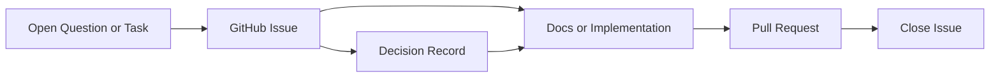

# Issue Management

このリポジトリでは、課題はすべて GitHub Issue で管理する。

## 原則

1. 未解決課題は README に長く保持しない
2. 着手単位、論点単位、検証単位で Issue を作る
3. 意思決定の根拠は Issue か、Issue から参照される `Decision Record` に残す
4. 作業ブランチ、コミット、PR は必ず対応する Issue を持つ
5. 仕様変更は、関連 Issue を先に更新してから文書や実装に反映する
6. lightweight task は fast-track issue として扱ってよい

## Issue にする対象

- 未解決の仕様論点
- 実証で検証すべき仮説
- 文書追加やテンプレート整備などの具体作業
- 将来やるが今は着手しない課題
- escalation や deadlock を伴う運用設計

## Issue に書く最小項目

- Summary
- Why
- Scope
- Exit Criteria
- References

## 運用ルール

- README の `未解決課題` は一覧の入口にとどめ、実態は Issue で追う
- 1 Issue 1 論点を基本にする
- 仕様論点と実装作業が混ざる場合は分ける
- 終了条件が書けない課題は、そのまま着手しない
- Issue を閉じるときは、関連する文書更新か `Decision Record` を残す
- 機械可読ログが必要な workflow では [docs/decision-log-profile.md](/Users/mn/Documents/Codex/2026-05-30/ai-ai-organization-framework-ai-ai/docs/decision-log-profile.md:1) に従う JSON companion を残してよい

## 推奨フロー

