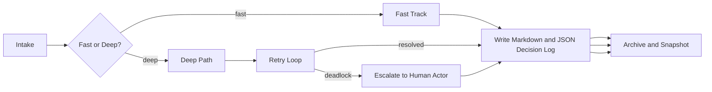

# Operational Safeguards

AI Organization Framework を実運用に近づけるための補助仕様。

## Purpose

この文書は、概念実証の段階で見えやすい次の tension に対処する。

1. human-in-the-loop と自律化の境界
2. 強い governance と agility の両立
3. actor 間のデッドロック回避
4. 肥大化する context の管理
5. 機械可読な decision trace

## Human Actor Rule

人間は外部オブザーバーではなく、必要なら正式な `Actor` として参加できる。

使い方は次の 3 つ。

1. `Requester`
2. `Human Actor`
3. `Escalation Authority`

### Requester

- 最初の依頼者
- clarification source
- outcome evaluator の一部になりうる

### Human Actor

- Council に参加してよい
- Builder, Guardian, Facilitator, Maintainer などの role を持ってよい
- AI actor と同じく governance の一部になれる

### Escalation Authority

- デッドロック時の裁定者
- veto conflict の最終判断者
- governance exception の承認者

## Routing Rule

すべての task を同じ重さで扱わない。  
`Clarification` または `Orientation` の段階で routing を決めてよい。

標準 routing は次の 2 系統。

### Fast Track

軽微で影響範囲が小さい task 向け。

例:

- typo fix
- docs wording change
- deterministic small refactor
- low-risk test fix

特徴:

- Builder 主導または最小 review で進めてよい
- Council full discussion は不要
- ただし value / intent consistency、feasibility、risk / quality の 3 観点 coverage は残す
- review trigger は軽くてよい

### Deep Path

変更影響が大きい task 向け。

例:

- architecture change
- release-critical change
- security-sensitive work
- policy-impacting change

特徴:

- Council of Three か同等の governance を通す
- explicit decision record を必須にする
- escalation path を持つ

## Routing Inputs

最低限次で fast/deep を判定できる。

1. blast radius
2. reversibility
3. compliance or safety impact
4. ambiguity level
5. dependency criticality

## Escalation Rule

actor 間の議論が進まない場合、無限に回してはいけない。

標準 safeguard:

1. `Max Retries`
2. `Timeout`
3. `Escalation Target`

### Max Retries

- 同じ論点での再試行回数
- 既定値は project ごとに決めてよい

### Timeout

- 判断待ちを続けてよい最大時間
- 同期でも非同期でもよい

### Escalation Target

- Human Actor
- Maintainer
- Governance owner
- Separate adjudicator

## Deadlock Rule

次の状態を deadlock とみなしてよい。

- Builder と Guardian が同じ理由で繰り返し reject/rework を行う
- required approval が timeout を超える
- risk acceptance の主体が不明

deadlock になったら次を行う。

1. disagreement summary を残す
2. remaining options を列挙する
3. human escalation または scope downgrade/stop を行う

## Context Lifecycle Rule

context は足し続けるだけではいけない。  
active context と archived context を分ける。
正式仕様は [docs/context-lifecycle-model.md](docs/context-lifecycle-model.md) を参照する。

最低限、次の 3 層を持てるとよい。

1. `Active Context`
2. `Context Summary`
3. `Context Archive`

### Active Context

- 現在の判断に直接必要な情報

### Context Summary

- 過去判断の圧縮要約
- active context に入れすぎないための中間層

### Context Archive

- 原資料や古い decision trace
- 必要時だけ参照する

## Snapshot and Rollback

context には snapshot を持てるようにする。

目的:

- 誤った learning の巻き戻し
- どの context state で判断したかの再現
- summary の更新失敗時の回復

## Archivist Role

`Archivist` は必須ではないが、有用な補助 role である。

役割:

- context summary を更新する
- old context を archive に送る
- snapshot を管理する
- retrieval entry point を整理する

## Machine-Readable Decision Log

自然言語の `Decision Record` だけでなく、機械可読な companion を持てるようにする。
正式仕様は [docs/decision-log-profile.md](docs/decision-log-profile.md) を参照する。

標準方針:

1. human-readable markdown を正本とする
2. machine-readable JSON companion を併置してよい
3. 両者は同じ decision id を共有する

最低限必要な構造:

- decision id
- scope
- request / need / intent / context summary
- selected option
- rationale summary
- change trigger
- review trigger
- optional forecast and actor notes

## Workflow

