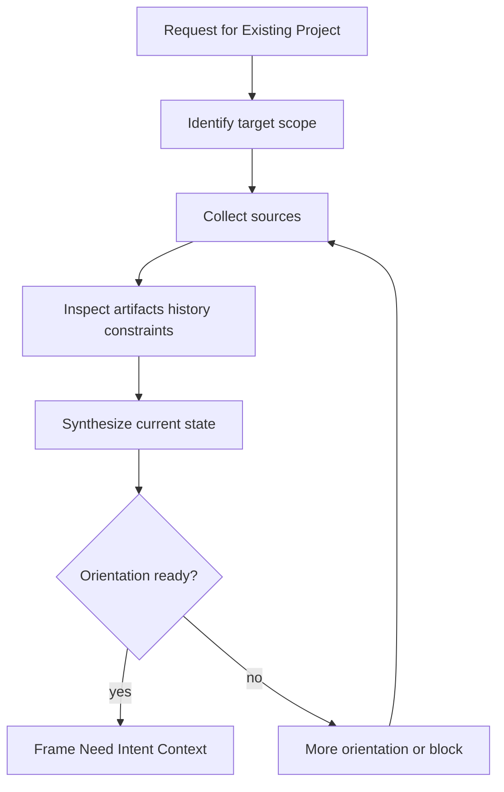
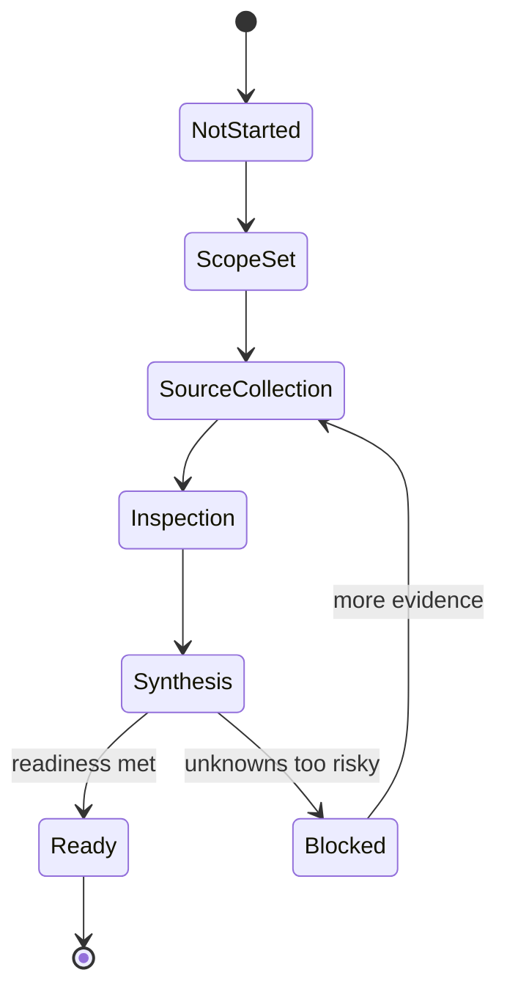

# Brownfield Orientation

AI Organization Framework における既存案件向け `Orientation` の仕様。

## 位置づけ

`Orientation` はコア概念ではない。  
既存案件に適用する場合の `Clarification` のサブモードである。

目的は、既に歴史を持つプロジェクトに途中参加するとき、背景、現状、制約、過去判断を把握しないまま危険な action に進まないようにすることにある。

greenfield では必須ではない。  
brownfield では通常必須である。

## 目的

`Orientation` は次のために行う。

- 対象範囲と現在状態を把握する
- 過去の意思決定と変更履歴を把握する
- inherited constraints と依存関係を把握する
- 既存 Artifact と未解決課題を把握する
- 誰が決めるべきかを見失わないようにする

## Sources

`Orientation` では次のような source を使える。

- 利用者や担当者への質問
- 既存文書
- 既存 Artifact
- 過去の `Decision Record`
- Issue や changelog
- コードや設定
- 現在の運用指標や障害情報

## Minimum Acquisition Set

`Orientation` を終えるまでに、最低限次を把握する。

1. 対象スコープと変更対象
2. 現在状態の要約
3. 参照した既存 Artifact
4. 関連する過去判断と変更履歴
5. inherited constraints と外部依存
6. 既知のリスクと未解決課題
7. 現時点の governance scope または decision owner

## Required Outputs

`Orientation` の出力は最低限次の形に落とす。

1. `Existing Artifacts Reviewed`
2. `Background or Prior Decisions`
3. updated `Context`
4. `Clarifications or Assumptions`
5. 必要なら orientation summary artifact

これにより、既存案件の履歴は単なる会話ログではなく、次の `Decision` に使える入力として残る。

## Readiness Criteria

次の条件を満たしたとき、`Orientation` は framing に進める。

1. 何を変えようとしているかが特定されている
2. 現在状態の主な source of truth が分かっている
3. 参照した既存 Artifact が列挙されている
4. 過去判断または判断不明点が記録されている
5. inherited constraints が context に反映されている
6. 危険な unknowns が assumptions か open issue として表面化している
7. 誰が最終判断するかが分かるか、少なくとも未確定であることが明示されている

## Minimum Context Completeness Checklist

brownfield orientation では、次の制約カテゴリを最低限確認対象に入れる。

1. authentication / authorization
2. legal / compliance / policy constraints
3. budget or cost limits
4. production safety or service continuity constraints
5. external dependency ownership

これらが不明な場合、`Context` は incomplete とみなしてよい。

## Human Owner Input Rule

特に次の制約は、model が自力で取り込み切れないことがある。  
そのため、human owner が明示入力する運用 guidance を持つ。

1. 法規制や監査制約
2. 予算上限
3. 組織内の禁止事項
4. production 変更窓口や停止許容時間

orientation は既存情報の読解だけではなく、必要なら human owner から constraint を補完して初めて完了とみなす。

## Failure Modes

`Orientation` で止まるべきパターン。

- source of truth が複数あり矛盾を解消できない
- 現在の production state が分からない
- 既存依存や禁止条件が不明
- 過去判断の理由が不明なまま差し替えようとしている
- decision owner や governance scope が見えない

この場合は framing や implementation に進まず、追加調査、追加質問、Issue 化、または blocked 扱いにする。

## Decision Record Connection

`Orientation` の結果は少なくとも次の項目に接続する。

- `Existing Artifacts Reviewed`
- `Background or Prior Decisions`
- `Context`
- `Clarifications or Assumptions`

## Workflow

## Lifecycle

## Example

### AIDLC Brownfield

- Request: onboarding 改善を進めたい
- Orientation:
  - 現行 onboarding spec を確認する
  - 既存コードと release notes を確認する
  - 過去 Issue と制約を確認する
  - 現行 KPI と既知障害を確認する
- Outputs:
  - `Existing Artifacts Reviewed`: onboarding spec v2, signup flow code, release note 2026-05, issue list
  - `Background or Prior Decisions`: 認証基盤は変更しない判断、モバイル先行判断
  - updated `Context`: 既存 API 維持、監査前で大規模変更不可
  - `Clarifications or Assumptions`: KPI 定義は次回確認、現行離脱計測は暫定値
