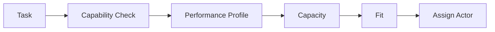

# Performance and Capacity Model

AI Organization Framework における Actor の性能特性モデル。

## 位置づけ

`Capability` は「何ができるか」を示す。  
それだけでは、「どの程度うまく、どのコストで、どの条件でできるか」は分からない。

そのため、`Capability` とは別に `Performance Profile` と `Capacity` を持てるようにする。

## Core Concepts

### Performance Profile

Actor が仕事をどのような特性で遂行するかを示す。

### Capacity

Actor が同時にどの程度の仕事を安全に扱えるかを示す。

### Fit

特定タスクとの相性や適性を示す。

## Core Rule

次を原則とする。

1. `Capability` と `Performance Profile` は別概念
2. `Performance Profile` は actor-specific でも task-specific でもよい
3. `Capacity` は同時実行や context handling の制約を表す
4. 比較に使うのは絶対評価より相対比較でよい

## Performance Dimensions

最低限、次の軸を扱えるようにする。

1. `Quality Stability`
2. `Speed`
3. `Reliability`
4. `Review Load`
5. `Retry Cost`
6. `Inference or Execution Cost`

意味は次の通り。

- `Quality Stability`: 出力品質のばらつきの少なさ
- `Speed`: 1 回の実行または iteration の速さ
- `Reliability`: 要件逸脱や失敗の起こりにくさ
- `Review Load`: 人手や上位 actor が必要とする review 負荷
- `Retry Cost`: やり直しに必要な追加コスト
- `Inference or Execution Cost`: 推論費用や実行資源の負荷

## Capacity Dimensions

最低限、次の軸を扱えるようにする。

1. `Parallel Safe Count`
2. `Context Window Pressure`
3. `Coordination Overhead`
4. `Escalation Need`

意味は次の通り。

- `Parallel Safe Count`: 安全に並列で動かせる単位数
- `Context Window Pressure`: 大きな文脈で劣化しやすいか
- `Coordination Overhead`: 他 actor との結合コスト
- `Escalation Need`: 人間や上位判断者への引き上げ頻度

## Fit Rule

同じ actor でも、タスクにより performance は変わる。  
そのため `Fit` を任意で記録してよい。

例:

- long-form design: high fit
- deterministic refactor: medium fit
- ambiguous stakeholder negotiation: low fit

## Representation Rule

厳密な数値でなくてもよい。  
次のような ordinal 表現で十分である。

- low / medium / high
- unstable / moderate / stable
- expensive / moderate / cheap

必要なら補助的に定量値を入れてよいが、必須ではない。

## Decision Rule

`Performance Profile` と `Capacity` は次のように使う。

1. option 間比較
2. actor assignment
3. forecast support
4. review design
5. escalation design

例:

- review load が高い actor には guardian review を強める
- parallel safe count が低い actor には分割投入しない
- reliability が低い actor には final approval を渡さない

## Decision Record Rule

`Decision Record` では、必要な場合だけ次を残す。

1. `Actor Performance Notes`
2. `Capacity Notes`
3. `Fit Notes`

これは actor choice や forecast に効いた場合だけでよい。

## Relationship to Forecast

`Forecast` は判断に必要な予測情報であり、`Performance Profile` と `Capacity` はその入力になりうる。

例:

- review load high -> forecast summary に影響
- retry cost high -> uncertainty notes に影響
- parallel safe count 3 -> forecast summary に影響

## Workflow

## Examples

### AI Refactor Worker

- Capability: implementation, test adjustment
- Quality Stability: medium
- Speed: high
- Reliability: medium
- Review Load: medium
- Retry Cost: low
- Parallel Safe Count: medium
- Fit: deterministic refactor high

### AI Architecture Reviewer

- Capability: design review, risk analysis
- Quality Stability: high
- Speed: medium
- Reliability: high
- Review Load: low
- Retry Cost: medium
- Parallel Safe Count: low
- Fit: cross-cutting design review high

### Human Maintainer

- Capability: final approval, context arbitration
- Quality Stability: high
- Speed: low
- Reliability: high
- Review Load: low
- Escalation Need: none
- Fit: governance decision high
