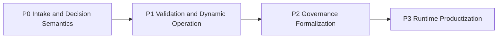

# Priority Roadmap

AI Organization Framework の現時点の優先順位。

## 原則

runtime や SDK を先に作らない。  
先に、曖昧な要求をどう受け、何をもって判断完了とみなすかを固める。

順序は次の原則で決める。

1. intake と decision の意味を先に固定する
2. その後で、実証と動的変化への対応を固める
3. 最後に、runtime/template/sdk として製品化する

## Priority P0

まず解くべき論点。

P0 は完了。

## Completed Foundation

先に固定した intake 基礎仕様。

- [#10 Clarification/Discovery phase](https://github.com/popcoondev/ai-organization-framework/issues/10)
- [#14 Brownfield orientation and context acquisition](https://github.com/popcoondev/ai-organization-framework/issues/14)

## Completed Policy Foundation

- [#2 Policy dimensions and weighting](https://github.com/popcoondev/ai-organization-framework/issues/2)

## Completed Completion Foundation

- [#8 Completion criteria and success criteria](https://github.com/popcoondev/ai-organization-framework/issues/8)

## Completed Forecast Foundation

- [#9 Forecast versus estimate](https://github.com/popcoondev/ai-organization-framework/issues/9)

## Priority P1

P0 の次に解く論点。

- 外的変化と AI ワーカー特性は、pilot と実運用で初めて解像度が上がるから

## Completed Validation Foundation

- [#5 Validate AIDLC pilot success criteria](https://github.com/popcoondev/ai-organization-framework/issues/5)

## Completed External Change Foundation

- [#6 External Signal/Event](https://github.com/popcoondev/ai-organization-framework/issues/6)

## Completed AI Worker Foundation

- [#7 AI Actor performance and capacity](https://github.com/popcoondev/ai-organization-framework/issues/7)

## Priority P2

P1 の後に formalization する論点。

P2 は完了。

## Completed Governance Safeguards

- [#15 Human Actor participation and escalation authority](https://github.com/popcoondev/ai-organization-framework/issues/15)
- [#16 Fast Track and Deep Path routing](https://github.com/popcoondev/ai-organization-framework/issues/16)
- [#3 Council of Three universality](https://github.com/popcoondev/ai-organization-framework/issues/3)
- [#4 Actor communication protocol](https://github.com/popcoondev/ai-organization-framework/issues/4)
- [#1 Role formal status](https://github.com/popcoondev/ai-organization-framework/issues/1)

これらは governance formalization の前提 safeguard、default governance definition、communication semantics、role boundary として固定した。

## Priority P3

P3 は完了。

理由:

- これらは実装開始点として魅力があるが、前段の仕様が曖昧だと再設計コストが高い
- 先に runtime を作ると、暫定仕様が実装に固定されやすい

## Completed Runtime Foundations

- [#11 Local template folder layout and manifest schema](https://github.com/popcoondev/ai-organization-framework/issues/11)
- [#17 Context lifecycle, snapshot, archive, and archivist role](https://github.com/popcoondev/ai-organization-framework/issues/17)
- [#18 Standardize machine-readable decision log companion](https://github.com/popcoondev/ai-organization-framework/issues/18)
- [#12 Local runtime trigger, session lifecycle, and persistence](https://github.com/popcoondev/ai-organization-framework/issues/12)
- [#13 SDK surface and adapters](https://github.com/popcoondev/ai-organization-framework/issues/13)

これらにより、template layout、context hygiene、decision log profile、session persistence、SDK boundary の前提を固定した。

## Execution Order

## Completed v1.1 Foundation

- [#146 Add v1.1 measurement foundation for process and outcome tracking](https://github.com/popcoondev/ai-organization-framework/issues/146)

`v1.1` の measurement foundation は完了した。  
ここで固定したものは次である。

1. `stage_transitions[]`
2. `routing_mode_history[]`
3. `reopen_count`
4. `outcome-report`
5. framing-only / runtime-on policy
6. same-session serial mutation policy

## Next Move

次に着手すべきものは `v1.8` の AOF-native task memory formalization である。  
主眼は、`v1.7` で揃えた orchestrator governance の上に、

- `.aof/tasks/` task ledger
- `.aof/goals/` goal projection
- Alignment Pulse の `Task Triage`
- Archivist の task / thread archive 拡張
- `.aof/` canonical directory structure
- framework self-audit

を固定することにある。

優先順は次である。

1. task management model
2. goals projection model
3. task triage in alignment pulse
4. Archivist scope expansion
5. `.aof/` directory structure
6. framework self-audit
7. release evidence packaging

`v1` の境界、non-goals、release gate、issue 棚卸し cadence は [docs/v1-release-definition.md](docs/v1-release-definition.md) を正本とする。  
`v1.1` の進化対象と完了条件は [docs/v1.1-release-definition.md](docs/v1.1-release-definition.md) を正本とする。
`v1.2` の concept layer と完了条件は [docs/v1.2-release-definition.md](docs/v1.2-release-definition.md) を正本とする。
`v1.3` の operating model と完了条件は [docs/v1.3-release-definition.md](docs/v1.3-release-definition.md) を正本とする。
`v1.4` の Human Visibility Layer と完了条件は [docs/v1.4-release-definition.md](docs/v1.4-release-definition.md) を正本とする。
`v1.5` の trust assumptions と完了条件は [docs/v1.5-release-definition.md](docs/v1.5-release-definition.md) を正本とする。
`v1.6` の experience validation と完了条件は [docs/v1.6-release-definition.md](docs/v1.6-release-definition.md) を正本とする。
`v1.7` の orchestrator governance と完了条件は [docs/v1.7-release-definition.md](docs/v1.7-release-definition.md) を正本とする。
`v1.8` の task memory と完了条件は [docs/v1.8-release-definition.md](docs/v1.8-release-definition.md) を正本とする。
