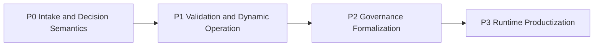

# Priority Roadmap

AI Organization Framework の現時点の優先順位。

## 原則

runtime や SDK を先に作らない。  
先に、曖昧な要求をどう受け、何をもって判断完了とみなすかを固める。

順序は次の原則で決める。

1. intake と decision の意味を先に固定する
2. その後で、実証と動的変化への対応を固める
3. 最後に、runtime/template/sdk として製品化する

## Priority P0

まず解くべき論点。

P0 は完了。

## Completed Foundation

先に固定した intake 基礎仕様。

- [#10 Clarification/Discovery phase](https://github.com/popcoondev/ai-organization-framework/issues/10)
- [#14 Brownfield orientation and context acquisition](https://github.com/popcoondev/ai-organization-framework/issues/14)

## Completed Policy Foundation

- [#2 Policy dimensions and weighting](https://github.com/popcoondev/ai-organization-framework/issues/2)

## Completed Completion Foundation

- [#8 Completion criteria and success criteria](https://github.com/popcoondev/ai-organization-framework/issues/8)

## Completed Forecast Foundation

- [#9 Forecast versus estimate](https://github.com/popcoondev/ai-organization-framework/issues/9)

## Priority P1

P0 の次に解く論点。

- 外的変化と AI ワーカー特性は、pilot と実運用で初めて解像度が上がるから

## Completed Validation Foundation

- [#5 Validate AIDLC pilot success criteria](https://github.com/popcoondev/ai-organization-framework/issues/5)

## Completed External Change Foundation

- [#6 External Signal/Event](https://github.com/popcoondev/ai-organization-framework/issues/6)

## Completed AI Worker Foundation

- [#7 AI Actor performance and capacity](https://github.com/popcoondev/ai-organization-framework/issues/7)

## Priority P2

P1 の後に formalization する論点。

- [#4 Actor communication protocol](https://github.com/popcoondev/ai-organization-framework/issues/4)
- [#1 Role formal status](https://github.com/popcoondev/ai-organization-framework/issues/1)

理由:

- これらは重要だが、P0 と P1 の結果を受けて固めた方が手戻りが少ない
- 特に `Role` と `Council` は、pilot や dynamic operation の知見を反映してからでも遅くない

## Completed Governance Safeguards

- [#15 Human Actor participation and escalation authority](https://github.com/popcoondev/ai-organization-framework/issues/15)
- [#16 Fast Track and Deep Path routing](https://github.com/popcoondev/ai-organization-framework/issues/16)
- [#3 Council of Three universality](https://github.com/popcoondev/ai-organization-framework/issues/3)

これらは governance formalization の前提 safeguard と default governance definition として先に固定した。

## Priority P3

最後に productize する論点。

- [#17 Context lifecycle, snapshot, archive, and archivist role](https://github.com/popcoondev/ai-organization-framework/issues/17)
- [#18 Standardize machine-readable decision log companion](https://github.com/popcoondev/ai-organization-framework/issues/18)
- [#11 Local template folder layout and manifest schema](https://github.com/popcoondev/ai-organization-framework/issues/11)
- [#12 Local runtime trigger, session lifecycle, and persistence](https://github.com/popcoondev/ai-organization-framework/issues/12)
- [#13 SDK surface and adapters](https://github.com/popcoondev/ai-organization-framework/issues/13)

理由:

- これらは実装開始点として魅力があるが、前段の仕様が曖昧だと再設計コストが高い
- 先に runtime を作ると、暫定仕様が実装に固定されやすい
- 特に context lifecycle と JSON companion は runtime 実装と一緒に詰めた方が無駄が少ない

## Execution Order

## Next Move

次に着手すべき 1 件は [#4](https://github.com/popcoondev/ai-organization-framework/issues/4) である。  
その次は [#1](https://github.com/popcoondev/ai-organization-framework/issues/1) である。

理由:

- governance の normative strength が確定したので、次は Actor 間通信をその前提で formalize できる
- 通信規格を固めたあとに `Role` の formal status を詰める方が、message semantics と役割境界を同時に見直せる
