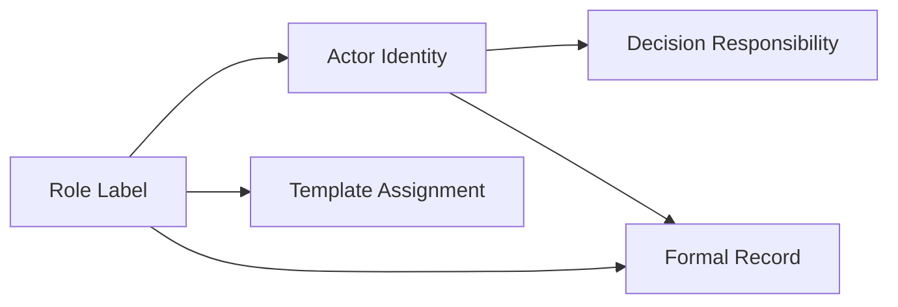

# Role Model

AI Organization Framework における `Role` の正式位置づけ。

## Conclusion

`Role` は core required concept ではない。  
optional but standardized helper concept として扱う。

つまり:

1. `Actor` は required
2. `Role` は optional
3. `Role` を使うなら、責務ラベルとして一定の規律に従う

## Why

`Role` を core required にすると、単純な組織でも毎回 role 設計が必要になり、過剰に重くなる。  
逆に完全に捨てると、Council seat、責務分担、handoff、escalation path を表す語彙が弱くなる。

そのため、最も矛盾が少ない位置づけは「任意だが標準化された補助概念」である。

## Normative Strength

規範強度は次の通り。

1. `Actor` identity は `required`
2. `Role` usage は `optional`
3. `Role` semantics は、使う場合に `required`

## Definition

`Role` は、Actor に付与される責務ラベルである。

`Role` 自体は意思決定主体ではない。  
意思決定主体は常に `Actor` である。

## Rules

### 1. Actor Priority Rule

accountability を伴う記録では、`Actor` identity を省略してはならない。

例:

- よい: `implementation-worker-01 (Builder)`
- よくない: `Builder` だけ

### 2. Many-to-Many Rule

- 1 Actor が複数 Role を持ってよい
- 1 Role を複数 Actor が担ってよい

### 3. Governance Rule

governance が実際に承認、拒否、escalation を行うのは Actor である。  
Role はその責務や seat semantics を補助する。

### 4. Seat Mapping Rule

`Visionary`、`Builder`、`Guardian` のような Council seat 名は、原則として Role として扱う。

ただし、非公式な図や例で shorthand として Actor 名のように書いてもよい。  
formal record では `Actor (Role)` の形を推奨する。

### 5. Template Use Rule

template、workflow、organization design では Role を積極的に使ってよい。  
runtime record や decision record では Actor を主、Role を従とする。

## Where Role Should Appear

Role を使うと有用なのは次の場所である。

1. organization template
2. governance seat definition
3. actor assignment table
4. escalation routing
5. handoff expectation

## Where Role Is Not Required

次では Role は必須ではない。

1. core ontology
2. minimal decision record
3. minimal runtime session state

## Decision Record Guidance

`Decision Makers` は Actor identity を正本とし、必要なら role label を添える。

推奨:

- `implementation-worker-01 (Builder)`
- `review-worker-02 (Guardian)`
- `human-maintainer (Escalation Authority)`

## Communication Guidance

communication protocol でも sender/recipient の主体は Actor である。  
必要なら message metadata に role label を併記してよい。

## AIDLC Interpretation

AIDLC の `Builder`、`Reviewer`、`Architect` は Role として扱う方が安定する。  
同じ Actor が Requirements phase では `Facilitator`、Implementation phase では `Builder` を兼ねてもよい。

## Model

