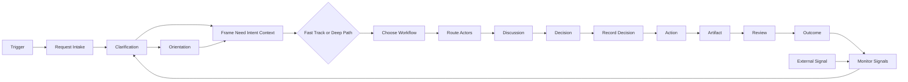
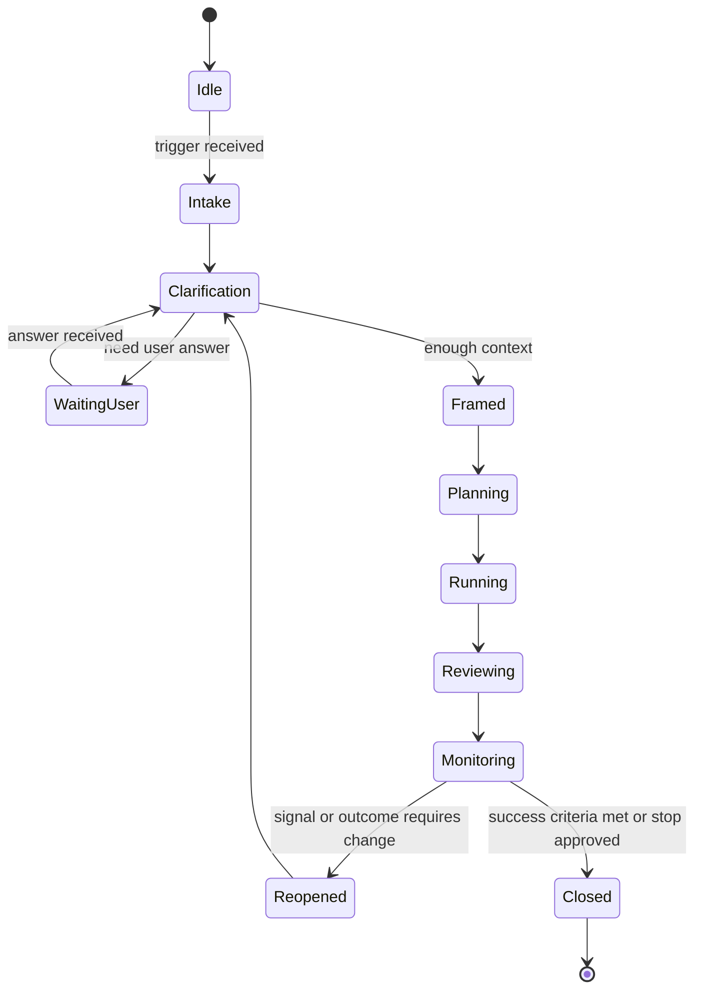

# Runtime and SDK

AI Organization Framework をローカル配置で自動稼働させるための初期設計メモ。

## 目的

このフレームワークを、文書だけでなく実際に起動できる形へ落とす。

最小構成は次の 3 層で考える。

1. `Template`
2. `Runtime`
3. `SDK`

## 3 層の役割

### Template

各プロジェクトに置く設定一式。

- Organization 定義
- Actor 定義
- Governance 定義
- Workflow 定義
- Prompt や policy の初期値
- Decision Record テンプレート

### Runtime

最初のトリガーからセッションを実行する層。

- trigger を受け取る
- clarification を回す
- `Need` `Intent` `Context` を framing する
- 必要なら forecast を集める
- 必要なら actor performance/capacity を比較する
- task の routing mode を判定する
- workflow を選ぶ
- actor/council を起動する
- decision と artifact を記録する
- signal や outcome を監視して reopen する
- external signal を分類して context update を判断する
- timeout や max retries 超過時は human actor に escalate する

### SDK

runtime が外部世界と接続するための共通インターフェース層。

- model adapter
- tool adapter
- storage adapter
- GitHub Issue adapter
- schema loader and validator

SDK boundary の正式仕様は [docs/sdk-surface-model.md](/Users/mn/Documents/Codex/2026-05-30/ai-ai-organization-framework-ai-ai/docs/sdk-surface-model.md:1) を参照する。

## ローカル配置イメージ

```text
project-root/
  .aof/
    organization.yaml
    governance.yaml
    policies.yaml
    actors/
      visionary.yaml
      builder.yaml
      guardian.yaml
    workflows/
      aidlc.yaml
    templates/
      decision-record.md
      decision-record.schema.json
    sessions/
    decisions/
      DEC-001.md
      DEC-001.json
    context/
      active/
      summaries/
      snapshots/
      archive/
    signals/
    artifacts/
```

この layout の正式仕様は [docs/template-manifest-model.md](/Users/mn/Documents/Codex/2026-05-30/ai-ai-organization-framework-ai-ai/docs/template-manifest-model.md:1) を参照する。

## Clarification phase

ユーザーへのヒアリングは必要である。  
ただし、これは常に長い対話を意味しない。

このフェーズの正式仕様は [docs/clarification-phase.md](/Users/mn/Documents/Codex/2026-05-30/ai-ai-organization-framework-ai-ai/docs/clarification-phase.md:1) を参照する。

`Clarification` は次の目的で行う。

- 曖昧な request を減らす
- 前提の欠落を埋める
- 禁止条件や成功条件を明確化する
- runtime が勝手に危険な解釈をしないようにする

入力が十分に明確な場合は short-circuit してよい。  
曖昧な場合は、runtime は利用者への質問か既存資料の確認を先に行う。

## Brownfield orientation

スクラッチ開始ではない場合、runtime は `Clarification` の一部として `Orientation` を行う必要がある。

このフェーズの正式仕様は [docs/orientation-phase.md](/Users/mn/Documents/Codex/2026-05-30/ai-ai-organization-framework-ai-ai/docs/orientation-phase.md:1) を参照する。

`Orientation` の目的は次の通り。

- 既存の背景や経緯を把握する
- 過去の意思決定や現在の制約を把握する
- 既存 Artifact と未解決課題を把握する
- 現在の状態を誤読したまま action しないようにする

最低限集める対象は次の通り。

- project background
- change history
- existing artifacts
- current constraints
- prior decisions
- known risks
- unresolved issues

greenfield では `Clarification` が中心になる。  
brownfield では `Orientation` を経由してから `Need` `Intent` `Context` の framing に入る。

`Orientation` の出力は、少なくとも次のどれかに落ちる必要がある。

- `Existing Artifacts Reviewed`
- `Background or Prior Decisions`
- `Clarifications or Assumptions`
- updated `Context`

## Runtime workflow



## Session lifecycle



session state と persistence の正式仕様は [docs/runtime-session-model.md](/Users/mn/Documents/Codex/2026-05-30/ai-ai-organization-framework-ai-ai/docs/runtime-session-model.md:1) を参照する。

完了条件と成功条件の詳細は [docs/completion-success-model.md](/Users/mn/Documents/Codex/2026-05-30/ai-ai-organization-framework-ai-ai/docs/completion-success-model.md:1) を参照する。
予測情報の扱いは [docs/forecast-model.md](/Users/mn/Documents/Codex/2026-05-30/ai-ai-organization-framework-ai-ai/docs/forecast-model.md:1) を参照する。
外的変化の扱いは [docs/external-signal-model.md](/Users/mn/Documents/Codex/2026-05-30/ai-ai-organization-framework-ai-ai/docs/external-signal-model.md:1) を参照する。
AI worker の性能特性は [docs/performance-capacity-model.md](/Users/mn/Documents/Codex/2026-05-30/ai-ai-organization-framework-ai-ai/docs/performance-capacity-model.md:1) を参照する。
fast path、escalation、context snapshot、machine-readable log は [docs/operational-safeguards.md](/Users/mn/Documents/Codex/2026-05-30/ai-ai-organization-framework-ai-ai/docs/operational-safeguards.md:1) を参照する。
governance template の規範強度は [docs/governance-template-model.md](/Users/mn/Documents/Codex/2026-05-30/ai-ai-organization-framework-ai-ai/docs/governance-template-model.md:1) を参照する。
Actor 間通信の正式仕様は [docs/actor-communication-protocol.md](/Users/mn/Documents/Codex/2026-05-30/ai-ai-organization-framework-ai-ai/docs/actor-communication-protocol.md:1) を参照する。
context lifecycle は [docs/context-lifecycle-model.md](/Users/mn/Documents/Codex/2026-05-30/ai-ai-organization-framework-ai-ai/docs/context-lifecycle-model.md:1) を参照する。
machine-readable decision log profile は [docs/decision-log-profile.md](/Users/mn/Documents/Codex/2026-05-30/ai-ai-organization-framework-ai-ai/docs/decision-log-profile.md:1) を参照する。
template folder layout と manifest schema は [docs/template-manifest-model.md](/Users/mn/Documents/Codex/2026-05-30/ai-ai-organization-framework-ai-ai/docs/template-manifest-model.md:1) を参照する。
runtime trigger、session lifecycle、state persistence は [docs/runtime-session-model.md](/Users/mn/Documents/Codex/2026-05-30/ai-ai-organization-framework-ai-ai/docs/runtime-session-model.md:1) を参照する。
SDK surface と adapter boundary は [docs/sdk-surface-model.md](/Users/mn/Documents/Codex/2026-05-30/ai-ai-organization-framework-ai-ai/docs/sdk-surface-model.md:1) を参照する。

## 初期トリガー

最初の trigger は次のどれかで十分である。

- CLI の引数
- API リクエスト
- GitHub Issue 作成
- ローカルファイルへの入力

最小の起動形は次のようなものになる。

```bash
aof run "初回離脱率を下げたい"
```

## 固定済みの基礎仕様

- `Clarification`: [docs/clarification-phase.md](/Users/mn/Documents/Codex/2026-05-30/ai-ai-organization-framework-ai-ai/docs/clarification-phase.md:1)
- `Orientation`: [docs/orientation-phase.md](/Users/mn/Documents/Codex/2026-05-30/ai-ai-organization-framework-ai-ai/docs/orientation-phase.md:1)

## 固定済みの Runtime Foundations

- [#11 local template folder layout and manifest schema](https://github.com/popcoondev/ai-organization-framework/issues/11)
- [#12 local runtime trigger, session lifecycle, and persistence](https://github.com/popcoondev/ai-organization-framework/issues/12)
- [#13 SDK surface and adapters](https://github.com/popcoondev/ai-organization-framework/issues/13)

## 依存する未解決論点
