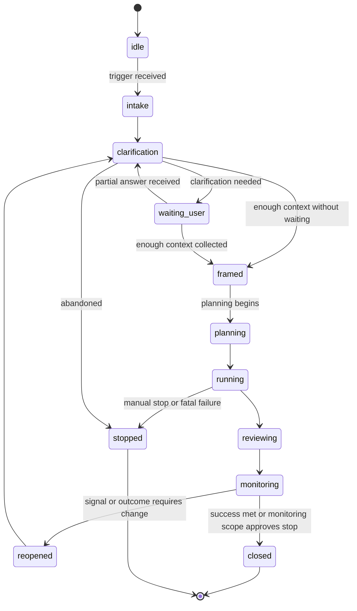

# Runtime Session Model

AI Organization Framework の local runtime trigger、session lifecycle、state persistence の正式仕様。

## Purpose

最初の trigger から始まる runtime session を、中断や再開を含めて再現可能にする。

## Trigger Model

runtime は次の trigger type を標準で受けられる。

1. `cli`
2. `api`
3. `github-issue`
4. `file-drop`
5. `external-signal`

trigger は最低限次を持つ。

- `trigger_id`
- `trigger_type`
- `received_at`
- `request_payload`

必要なら次も持てる。

- `source_ref`
- `related_session_id`
- `related_decision_id`

## Session Identity

session は最低限次で識別する。

- `session_id`
- `workflow_id`
- `organization_id`
- `created_at`
- `status`

## Session States

標準 state は次とする。

1. `idle`
2. `intake`
3. `clarification`
4. `waiting_user`
5. `framed`
6. `planning`
7. `running`
8. `reviewing`
9. `monitoring`
10. `reopened`
11. `closed`
12. `stopped`

## Lifecycle



## State Meaning

`status` と `current_stage` は同一である必要はない。  
たとえば clarification が完了した session はいったん `status: framed` になり、その後 `current_stage: planning` を持って planning に入ってよい。

## Naming Rule

`current_stage` と `status` では naming rule を分けてよい。  
標準では次を使い分ける。

- stage / action / recommendation は base verb を使う
  - 例: `clarification`, `planning`, `review`, `approval`, `reopen`
- session status は lifecycle state を使う
  - 例: `waiting_user`, `framed`, `reopened`, `closed`, `stopped`

したがって `current_stage: "reopen"` と `status: "reopened"` は別概念であり、矛盾ではない。
前者は「再判断または再 framing を行う workflow stage」、後者は「既存 session が再開済みである lifecycle state」を意味する。

### `framed`

clarification が完了し、Need / Intent / Context が次 stage に渡せる状態。  
通常は短い中間 state であり、次に `planning` へ進む。

### `waiting_user`

human answer 待ち。  
timeout policy の対象になってよい。

### `monitoring`

artifact delivery 後で、outcome や external signal を見ている状態。
`closed` に進めるのは、success criteria を満たしたとき、または monitoring scope / outcome owner が「これ以上の追跡や追加 action を行わず stop してよい」と判断したときである。

### `reopened`

一度進んだ session が、新しい signal、negative outcome、policy change で再開された状態。

`reopened` は stage 名ではなく session lifecycle status である。  
再開後に runtime は通常 `current_stage: clarification` へ戻すが、governance や signal disposition に応じて他の stage へ再投入してもよい。

signal reopen では `routing_mode` を維持してもよいが、外部 signal の review depth が高い場合は `fast-track` から `deep-path` へ引き上げてよい。
`context-only` signal は reopen を必須とせず、現在の `status` / `current_stage` を維持したまま context update のみを記録してよい。

### `stopped`

停止は closed と違う。  
done でも success でもなく、manual stop、fatal error、scope cancellation を意味する。

## Persistence Model

runtime は最低限次を永続化する。

1. session state
2. clarification log
3. selected workflow
4. routing mode
5. current context snapshot reference
6. decision references
7. artifact references
8. signal references

## On-Disk Files

推奨 layout:

```text
.aof/
  sessions/
    SESS-LX9KS8-AB12CD.json
  decisions/
    DEC-LX9KS8-EF56GH.md
    DEC-LX9KS8-EF56GH.json
  context/
    active/
    summaries/
    snapshots/
    archive/
  signals/
    SIG-001.json
  artifacts/
```

## Session File Schema

`sessions/SESS-LX9KS8-AB12CD.json` は最低限次を持つ。

- `session_id`
- `workflow_id`
- `organization_id`
- `status`
- `trigger`
- `current_stage`
- `stage_transitions`
- `routing_mode optional`
- `routing_mode_history`
- `reopen_count`
- `context_snapshot_id optional`
- `open_decision_ids`
- `closed_decision_ids`
- `artifact_refs optional`
- `signal_refs optional`
- `outcome_reports`
- `created_at`
- `updated_at`

`current_stage` は free-form string ではなく、stage-role matrix にある stage に制限する。

- `clarification`
- `planning`
- `proposal`
- `review`
- `approval`
- `reopen`

`routing_mode` は runtime がどれだけ軽量に stage を通すかを表す。

- `deep-path`
  - default mode
  - planning では Builder に加えて Visionary review を要求する
  - proposal / review / approval でも standard council participation を維持する
- `fast-track`
  - lightweight task 向けの短縮 mode
  - planning と proposal は Builder primary のみで進められる
  - review / approval は Guardian の minimal review を基本にする

選択優先順は次とする。

1. explicit runtime override
2. workflow `default_routing_mode`
3. fallback `deep-path`

`stage_transitions` は stage と lifecycle status の変化を時系列で残す。  
minimum first cut では次を持つ。

- `from_stage`
- `to_stage`
- `from_status`
- `to_status`
- `at`
- `reason optional`

`routing_mode_history` は `fast-track` と `deep-path` の変更履歴を残す。  
minimum first cut では次を持つ。

- `from_mode`
- `to_mode`
- `at`
- `reason optional`

`reopen_count` は session が reopen された回数の machine-readable counter とする。  
`outcome_reports` は decision 後の actual outcome を還流する append-only history とし、minimum first cut では次を持つ。

- `report_id`
- `result`
  - `success`
  - `partial`
  - `failure`
- `observed_at`
- `note`
- `signal_ref optional`

`session_id`、`trigger_id`、`decision_id`、`context_snapshot_id` などの runtime ID は、
`PREFIX-<base36 timestamp>-<random suffix>` 形式を canonical とする。

runtime timestamp は `new Date().toISOString()` に合わせ、UTC ISO 8601 の `Z` 形式を canonical とする。

## Clarification Persistence

clarification は session file に埋めてもよいが、長くなるなら別 file に分けてよい。

最低限残すもの:

- asked questions
- question rationale
- trigger classes
- target fields
- user answers
- assumptions
- unresolved ambiguity
- clarification round count

## Resume Rule

runtime は次の状態から resume できる。

- `waiting_user`
- `planning`
- `running`
- `monitoring`
- `reopened`

resume 時は最低限次を確認する。

1. referenced context snapshot が存在する
2. open decision ids が整合している
3. related artifacts / signals path が解決できる

## Reopen Rule

session reopen は新規 session ではなく、既存 session の continuation として扱ってよい。

reopen 条件の例:

- success criteria unmet
- negative outcome observed
- external signal received
- governance override

## Stop Rule

stop は close と分ける。  
次のような場合に `stopped` に入る。

- manual cancellation
- unresolved fatal dependency
- invalid template or persistence corruption

stop 時は次を残す。

- stop reason
- recoverability
- suggested next action

## First Runnable Prototype Scope

最初の local prototype は次までで十分である。

1. CLI trigger
2. 1 workflow only
3. one active session at a time
4. JSON session persistence
5. markdown + JSON decision persistence
6. clarification answer ingestion
7. reopen from signal file

## Example Session File

```json
{
  "session_id": "SESS-LX9KS8-AB12CD",
  "workflow_id": "aidlc",
  "organization_id": "product-team",
  "organization": {
    "language": "ja"
  },
  "status": "waiting_user",
  "trigger": {
    "trigger_id": "TRG-LX9KS8-CD34EF",
    "trigger_type": "cli",
    "received_at": "2026-05-31T07:30:00.000Z",
    "request_payload": "初回離脱率を下げたい"
  },
  "current_stage": "clarification",
  "routing_mode": "deep-path",
  "context_snapshot_id": null,
  "open_decision_ids": ["DEC-LX9KS8-EF56GH"],
  "closed_decision_ids": [],
  "created_at": "2026-05-31T07:30:00.000Z",
  "updated_at": "2026-05-31T07:30:20.000Z"
}
```
