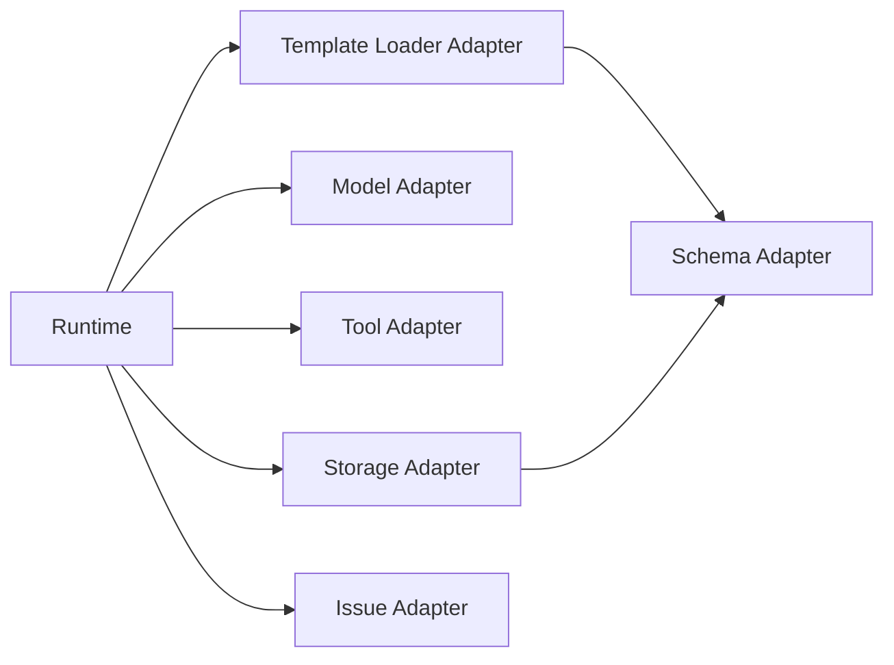

# SDK Surface Model

AI Organization Framework における SDK boundary と adapter surface の正式仕様。

## Purpose

runtime ごとの実装差分を SDK adapter に押し込み、workflow logic と spec model を安定させる。

## Layer Boundary

この framework は次の 4 層で分ける。

1. `Spec`
2. `Template`
3. `Runtime`
4. `SDK`

## Spec

概念と運用規則を定義する層。

例:

- governance model
- decision record model
- context lifecycle
- communication protocol

Spec は external system を直接知らない。

## Template

project-local な設定と folder layout。

例:

- `.aof/aof.yaml`
- actor files
- workflow files
- templates

Template は project の初期状態を表すが、実行はしない。

## Runtime

session を進める orchestration layer。

責務:

- trigger を受ける
- session state を進める
- clarification / orientation / planning / monitoring を回す
- decision record を出す
- reopen / stop / resume を判断する

Runtime は「何をすべきか」を知る。  
ただし、外部 system とどう接続するかは SDK に委ねる。

## SDK

runtime が外部世界に接続するための adapter contract 集合。

SDK は次を提供する。

1. model access
2. tool invocation
3. storage access
4. issue system access
5. schema loading and validation

## Core Rule

runtime logic は adapter interface だけに依存する。  
filesystem、GitHub、model vendor などの実装差は SDK adapter に閉じ込める。

## Adapter Set

### 1. Template Loader Adapter

責務:

- `.aof/aof.yaml` を読む
- component file を解決する
- manifest/schema validation を走らせる

入出力:

- input: project root
- output: normalized runtime template object

### 2. Model Adapter

責務:

- actor に対応する model call を実行する
- prompt/input/output を正規化する
- provider 差分を隠蔽する

model call に渡す packet の正式仕様は [docs/model-input-assembly.md](docs/model-input-assembly.md) を参照する。

最低限必要:

- `generate`
- `generate_structured optional`
- `stream optional`

### 3. Tool Adapter

責務:

- runtime が必要な external tool を起動する
- capability name と actual tool call を対応づける

最低限必要:

- `list_tools`
- `invoke_tool`

### 4. Storage Adapter

責務:

- session
- decision
- context
- signal
- artifact metadata

を保存・取得する。

最低限必要:

- `read`
- `write`
- `append optional`
- `list`
- `exists`

初期 target は local filesystem でよい。

### 5. Issue Adapter

責務:

- issue create
- issue read
- comment
- close / reopen

を runtime から切り離す。

初期 target は GitHub Issue でよい。  
将来は Jira や local issue store へ差し替え可能にする。

### 6. Schema Adapter

責務:

- JSON schema load
- validate
- error normalize

最低限必要:

- `load_schema`
- `validate`

## Non-Goals

SDK は workflow engine ではない。  
governance も decision rule も SDK には置かない。

次は runtime 側に残す。

- routing decision
- escalation policy use
- state transition
- decision finalization

## Suggested Module Boundary

```text
aof-spec/
aof-runtime/
aof-sdk/
  template-loader/
  models/
  tools/
  storage/
  issues/
  schemas/
```

## Runtime to SDK Contract

runtime から見える surface は次で足りる。

- `loadTemplate(projectRoot)`
- `validateTemplate(template)`
- `startSession(trigger)`
- `loadSession(sessionId)`
- `saveSession(session)`
- `saveDecision(record)`
- `loadSignals(sessionId or scope)`
- `invokeModel(actor, prompt, options)`
- `invokeTool(toolName, input)`
- `syncIssue(issueOperation)`

実装詳細は adapter ごとに自由だが、runtime から見える contract は安定させる。

## Initial Integration Targets

最初の target は次で十分である。

1. local filesystem storage
2. local `.aof/` template loader
3. GitHub Issue adapter
4. existing model provider adapter

ただし `.aof/aof.yaml` の raw file を直接 model に渡すのではなく、runtime が `Model Input Packet` に組み立ててから adapter に渡す。

## Example Boundary



## Completion Criterion

`#13` が閉じた時点で必要なのは、SDK implementation ではなく boundary clarity である。  
つまり、runtime の workflow logic を adapter contract に対して書ける状態になっていればよい。
