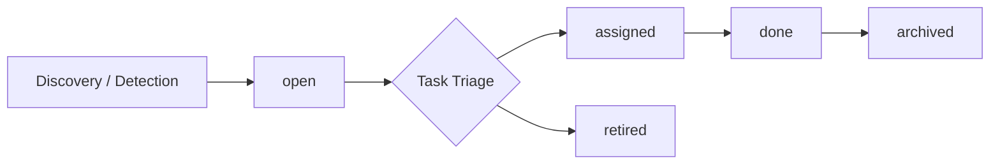

# Task Management Model

AI Organization Framework における `v1.8` の AOF-native task management model。

## Position

`v1.8` では `.aof/tasks/` を AOF の唯一の task ledger とする。  
GitHub Issues や外部 tracker は mirror になってよいが、source of truth ではない。

## Directory Structure

```text
.aof/
  tasks/
    open/
    assigned/
    done/
    archived/
    retired/
```

各 task は `TASK-{id}.json` 形式の JSON 1 件とする。

## Lifecycle

task は最低限次の lifecycle を持つ。

1. `open`
2. `assigned`
3. `done`
4. `archived`
5. `retired`



## Origin

task の起票者は最低限次を許容する。

1. Discovery Scout
2. Experience Steward
3. Guardian
4. Orchestrator
5. Human

## Ownership

`v1.8` では task ownership を `single session owner` ではなく、  
**orchestrator-centered ownership** とする。

最低限、task は次を持てる必要がある。

1. `orchestrator_session_id`
2. `assigned_session_ids[]`
3. `related_decision_record_id`
4. `operating_goal_ref`

つまり、task は child thread に 1 対 1 で閉じない。  
canonical owner は Orchestrator とする。

## Transition Authority

### `open -> assigned`

次のどちらかでよい。

1. Orchestrator が Current Operating Goal と整合すると判断した
2. Human が着手を明示した

### `open -> retired`

次のどちらかでよい。

1. Human が不要と判断した
2. Orchestrator が stale かつ misaligned と判断し、Human が承認した

### `assigned -> done`

次が揃ったとき。

1. task の作業が完了した
2. 関連 Decision Record または equivalent artifact が記録された

### `done -> archived`

Archivist が定期実行または explicit call により移動してよい。  
毎回 Human 承認を必須にしない。

## Task Triage

`Alignment Pulse` では `.aof/tasks/open/` を棚卸しする。

最低限の問い:

1. Current Operating Goal と整合する task はどれか
2. すぐ着手すべき task はどれか
3. stale task を retire 候補にするか

## Session Binding

task と session の binding は次で読む。

- `orchestrator_session_id`: canonical owner
- `assigned_session_ids[]`: working child sessions
- `related_decision_record_id`: completion or disposition evidence

## Timestamp Guidance

task には少なくとも次の lifecycle metadata を持たせる。

1. `created_at`
2. `updated_at`
3. `assigned_at optional`
4. `done_at optional`
5. `retired_at optional`
6. `last_triaged_at optional`

理由:

- stale 判定
- archive timing
- retire 説明
- triage cadence

を later inference ではなく explicit metadata で扱いたいからである。

## External Tool Rule

GitHub Issues などの外部 tracker を使ってもよいが、次を守る。

1. `.aof/tasks/` が source of truth
2. 外部 tracker は mirror
3. external id が必要なら task 側の reference field で持つ
