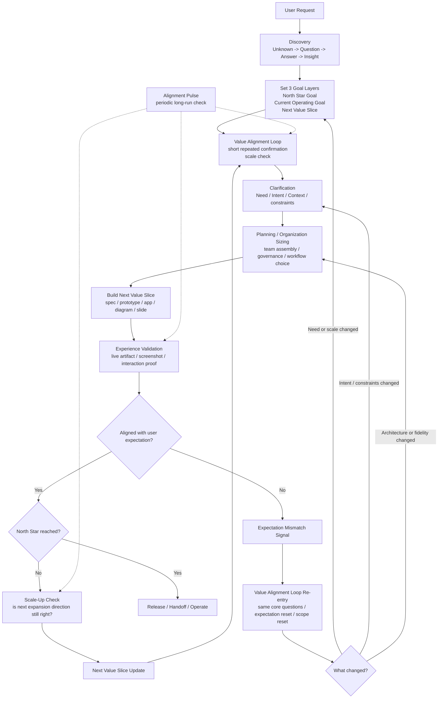

# Value Alignment Loop

AI Organization Framework における `v1.6` の value alignment loop。

## Position

AOF は完成品の `Goal` を見失ってはいけない。  
同時に、毎回の作業は `Next Value Slice` として小さく前進させる必要がある。

`Value Alignment Loop` は、この 2 つを結びながら、

- ユーザーの未確定さ
- スケールアップ方向
- live experience の期待

を短い再確認で保つための cross-cutting loop である。

## Goal Layers

`v1.6` では、次の 3 層を同時に持つ。

1. `North Star Goal`
2. `Current Operating Goal`
3. `Next Value Slice`

役割は次の通り。

- `North Star Goal`
  - 最終的に何を成立させたいか
- `Current Operating Goal`
  - この checkpoint 群で何を前進とみなすか
- `Next Value Slice`
  - 次にユーザーへ見せる動く価値、または visible proof

## Loop Behavior

`Value Alignment Loop` は長い面談ではない。  
短い再確認を、必要な地点で繰り返す。

特に重要なのは次である。

1. 前回と同じ問いを再確認してよい
2. ぶれていなければ回答負荷は低くてよい
3. ぶれたときだけ深掘りする
4. visible artifact を見ながら確認する

## Recent Confirmation Window

AOF は無限に確認履歴を読み返す必要はない。  
runtime と review が常に強く参照すべきなのは、次の recent window である。

1. 直近数回の confirmation
2. 現在有効な expectation
3. unresolved mismatch
4. 次の scale-up decision に効く差分

## Preferred Review Proofs

確認は、できるだけ目に見えるものを使う。

1. live artifact
2. screenshot set
3. interaction proof
4. flowchart / sequence / diagram
5. slides / static notes

## Trigger Points

`Value Alignment Loop` は次の地点で発火できる。

1. discovery acceleration の直後
2. clarification で critical unknown が残るとき
3. experience validation の直前または直後
4. `expectation-mismatch` が出たとき
5. reprioritize / re-scope / reframe のとき
6. long-running work の `alignment pulse`

## Alignment Pulse

`alignment pulse` は、長い作業でたまに挟む軽い健全性確認である。  
ランダム検査ではなく、進行距離に対する cadence check として扱う。

最低限、次を確認する。

1. まだ解くべき問題は同じか
2. いま見えている value slice は期待に近づいているか
3. 次の scale-up 方向はまだ正しいか

## Stop Rule

確認を長引かせないため、次のどれかが立ったら loop は一旦止めてよい。

1. `Current Operating Goal` が切れた
2. `Next Value Slice` が定義できた
3. mismatch criteria が定義できた
4. current decision を進めるのに十分な certainty がある

## Relationship To Runtime

この loop を強く使う案件では、runtime の価値が高い。  
理由は次の通り。

- recent confirmation window を保持する必要がある
- repeated confirmation の差分を追う必要がある
- `expectation-mismatch` と `alignment pulse` を state として残す必要がある

したがって、uncertainty が高い案件、探索案件、体験案件では `runtime mandatory` を標準寄りに扱う。

## Canonical Lifecycle

